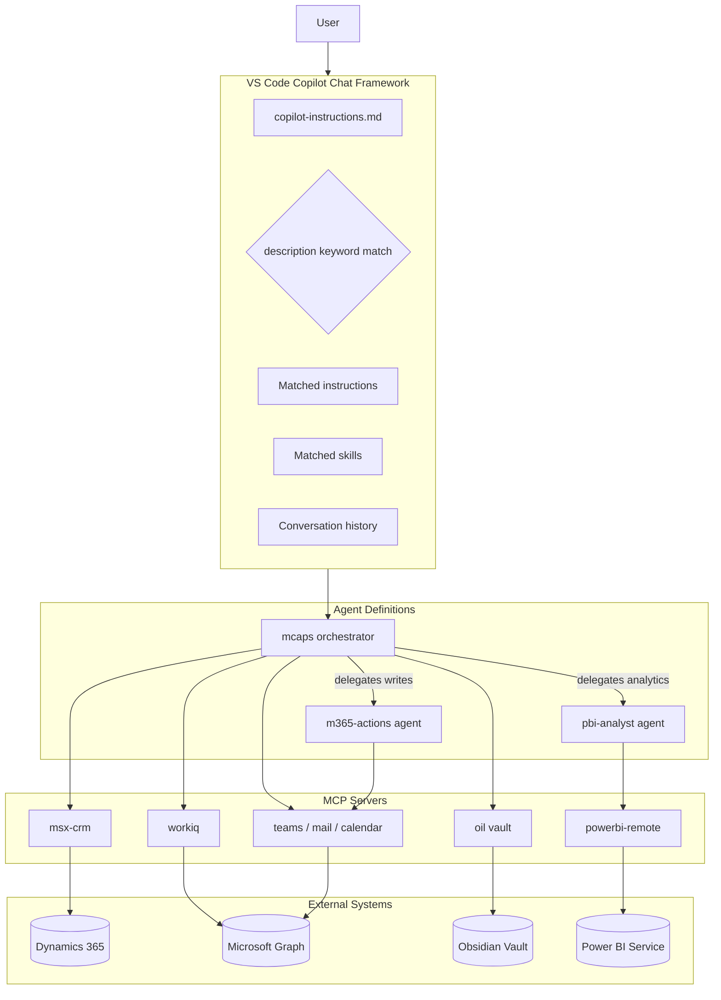
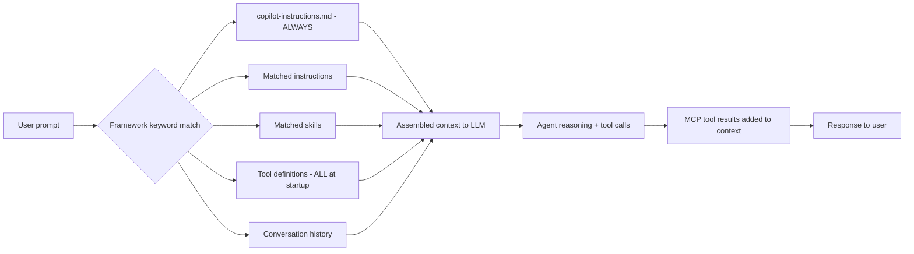
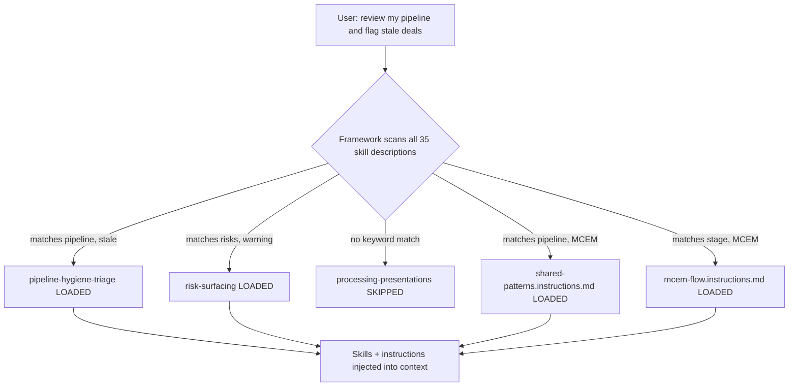
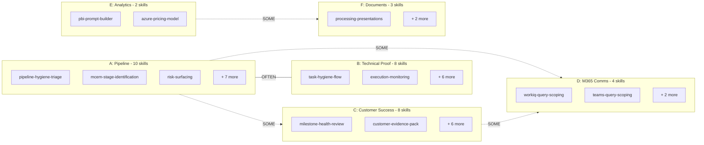
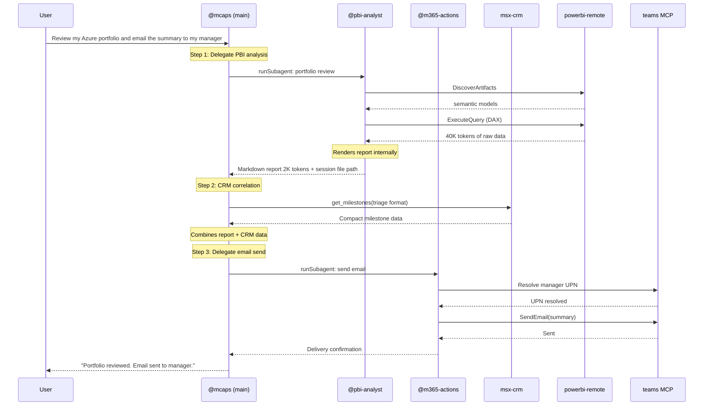
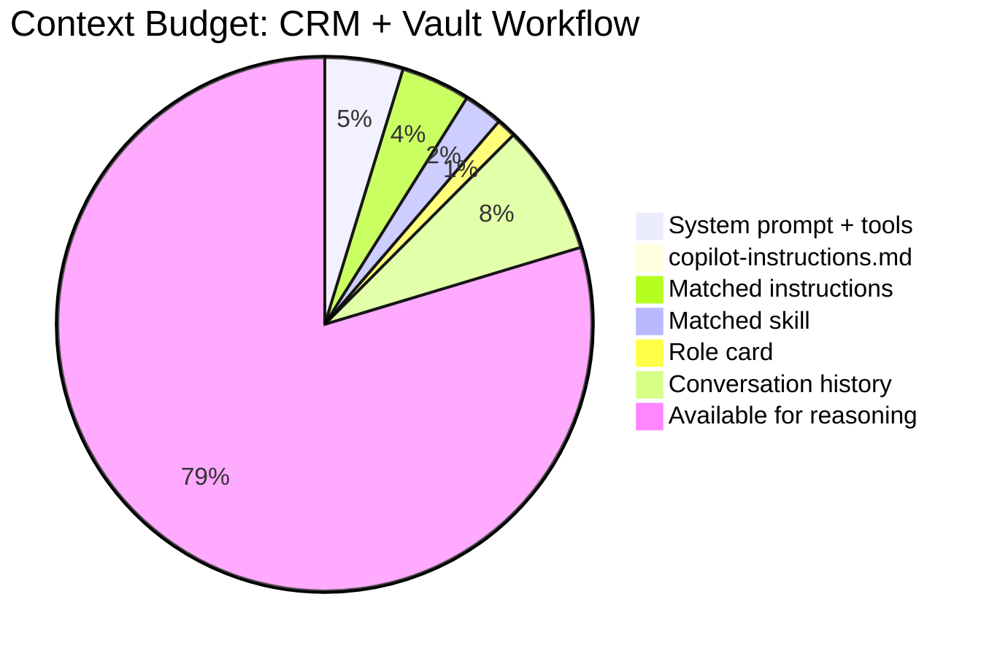
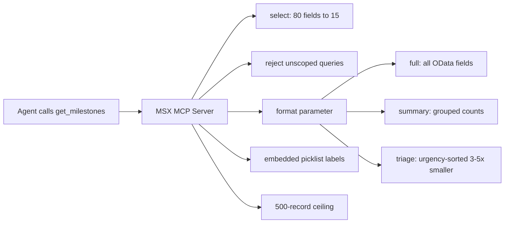

# MCAPS-IQ Context Optimization Spec

> **Version**: 2.1.0 — 2026-03-15
> **Status**: Actionable
> **Scope**: Context efficiency improvements for the MCAPS-IQ agent within the VS Code Copilot framework

---

## 1. System Overview

MCAPS-IQ is a multi-MCP-server agent system for Microsoft account teams. It connects CRM (Dynamics 365), M365 communication, an Obsidian knowledge vault, and Power BI analytics through the VS Code Copilot Chat agent framework.

---

## 2. Context Assembly — How the Framework Works

The agent author does not control context assembly. The framework does it automatically:

### What we control vs. what we don't

| We control | We do NOT control |
|---|---|
| File sizes (instructions, skills, `copilot-instructions.md`) | Which files load (framework matches by `description` keywords) |
| Skill `description` keywords (routing accuracy) | Tool registration (all MCP tools load at startup, every turn) |
| MCP server response format/size | Context budget enforcement (no token counting API) |
| Subagent delegation (isolates heavy workflows) | Conversation history management |

**Key principle**: The optimization lever is *"make loaded files smaller and MCP responses leaner"* — not building a custom orchestration layer.

---

## 3. Skill Routing via Description Matching

The `description` field in each SKILL.md frontmatter **is** the intent router. The framework matches user prompts against these descriptions to decide what to load.

**Implication**: The quality of `description` keywords directly controls routing accuracy. Bad descriptions cause false positives (wasted context) or false negatives (missing capabilities).

---

## 4. Domain Clusters

35 skills grouped into 6 clusters by data source and co-activation pattern. This informs which instruction files benefit from shared context.

**Key takeaways**:

- **A↔B co-activate OFTEN** → shared context (CRM schema, MCEM stages) benefits both
- **D** is a cross-cutting evidence layer → scoping skills stay self-contained
- **E** is the best subagent candidate — high token cost, low co-activation

---

## 5. Subagent Architecture

Subagents (`.github/agents/*.agent.md`) run in isolated context windows. Tool results stay in the subagent; only the final response returns.

### Agents

| Agent | Status | Tools | When to use | Token impact |
|---|---|---|---|---|
| **@mcaps** | Existing | msx-crm, oil, workiq, teams, mail, calendar | Main orchestrator for all CRM/vault workflows | — |
| **@m365-actions** | Existing | teams, mail, calendar | Send messages, emails, create events | Low (fire-and-forget) |
| **@pbi-analyst** | **Recommended** | powerbi-remote, editFiles | Any Power BI DAX query or report rendering | **High** — keeps 15K–80K tokens out of main context |

### NOT recommended as subagents

| Candidate | Reason |
|---|---|
| deal-triage | A↔B co-activation too high; CRM data already in main context |
| vault-analyst | Vault calls are fast (2–3 calls); high co-activation with every workflow |

---

## 6. Instruction File Trimming

The highest-impact optimization. Every token in an instruction file costs context space each time it's loaded.

### Current vs. Target Sizes

**Current vs. target line counts:**

| File | Current | Target | Reduction |
| --- | --- | --- | --- |
| copilot-instructions | 100 | 60 | -40% |
| shared-patterns | 233 | 120 | -48% |
| intent | 154 | 80 | -48% |
| obsidian-vault | 382 | 150 | -61% |
| crm-entity-schema | 420 | 200 | -52% |
| mcem-flow | 204 | 120 | -41% |
| pbi-context-bridge | 123 | 100 | -19% |
| role cards (x4) | 55-71 | keep | — |

| File | Current | Target | Savings | What moves out |
|---|---|---|---|---|
| `copilot-instructions.md` | 100 | 60 | **~800 tokens/turn** | Context Loading Architecture table, Authoring Rules → `CONTRIBUTING.md` |
| `shared-patterns.instructions.md` | 233 | 120 | **~2,300 tokens** | 19-row skill-chain table → `.github/documents/skill-chains.md`; Connect hook detail → `connect-hooks.instructions.md`; CRM linkification → 5-line summary |
| `intent.instructions.md` | 154 | 80 | **~1,500 tokens** | "House" room table, verbose prose → onboarding docs |
| `obsidian-vault.instructions.md` | 382 | 150 | **~4,000 tokens** | Vault-init walkthrough, directory structure, troubleshooting → `mcp/oil/README.md` |
| `crm-entity-schema.instructions.md` | 420 | 200 | **~4,000 tokens** | Extended entities (accounts, contacts, connections) → `.github/documents/crm-schema-extended.md` |
| `mcem-flow.instructions.md` | 204 | 120 | **~1,600 tokens** | Per-criteria explanations → `.github/documents/mcem-detail.md` |
| `pbi-context-bridge.instructions.md` | 123 | 100 | ~500 tokens | DAX code examples (agent should follow PBI prompt files) |
| Role cards (×4) | 55–71 | Keep | — | Already right-sized; only one loads per session |

### Net effect on a typical CRM workflow

Current instruction overhead for a typical turn: **~23,000 tokens** → After trim: **~12,500 tokens**. That's ~10,000 tokens freed for tool results and agent reasoning.

---

## 7. MCP Response Optimization

The second lever: make tool results smaller at the source.

### Current optimizations (already implemented)

### Recommended additions

| Change | Server | Impact |
|---|---|---|
| `format: "compact"` for `list_opportunities` | msx-crm | Returns only: id, name, stage, close date, revenue, health |
| `maxResults` for `get_my_active_opportunities` | msx-crm | Caps portfolio scans for users with 50+ opportunities |
| `maxResults` for `search_vault` (default 10) | oil | Caps large vault searches |
| `summaryOnly` flag for `get_customer_context` | oil | Returns only GUIDs + team roster, no engagement history |

---

## 8. Skill Description Quality

Since `description` is the only routing mechanism, description quality directly controls system behavior.

### Audit criteria

1. **Explicit trigger phrases** — the exact words users type, not abstract concepts
2. **Negative triggers** — "DO NOT USE FOR: ..." prevents false positives
3. **No sibling overlap** — distinct trigger sets between related skills
4. **Role named** — helps framework prioritize when multiple skills match

### Known issues

| Skill | Problem | Fix |
|---|---|---|
| `partner-motion-awareness` | Too short (49 words), low keyword coverage | Add: "partner POC, partner delivery, SI engagement, co-sell deal registration" |
| `customer-outcome-scoping` | Overlaps with `adoption-excellence-review` on "KPIs" | Add: "DO NOT USE FOR: reviewing existing adoption metrics" |
| `execution-authority-clarification` | Only fires on "tie-break" | Add: "who has final say, authority dispute, escalation path, decision owner" |
| `non-linear-progression` | "regression" collides with software testing context | Replace with "deal regression, stage rollback" |

---

## 9. Action Items

Three batches, ordered by impact. Ship as PRs, not phases.

### Batch 1 — File Trimming

| # | Action | Files |
|---|---|---|
| 1.1 | Trim `copilot-instructions.md` — remove Context Loading Architecture, Authoring Rules | 1 file |
| 1.2 | Trim `shared-patterns` — extract chain table to `.github/documents/`, deduplicate Connect hooks | 2 files |
| 1.3 | Trim `intent.instructions.md` — remove House table, compress prose | 1 file |
| 1.4 | Split `crm-entity-schema` — core stays, extended entities → `.github/documents/` | 2 files |
| 1.5 | Trim `obsidian-vault` — move setup/troubleshooting → `mcp/oil/README.md` | 2 files |
| 1.6 | Condense `mcem-flow` — compact stage table, detail → `.github/documents/` | 2 files |

### Batch 2 — Subagent + Response Optimization

| # | Action | Files |
|---|---|---|
| 2.1 | Create `@pbi-analyst` agent definition | 1 new `.agent.md` |
| 2.2 | Update `pbi-context-bridge` to reference `@pbi-analyst` | 1 file |
| 2.3 | Add `format: "compact"` to `list_opportunities` | `mcp/msx/src/tools.js` |
| 2.4 | Add `maxResults` to `get_my_active_opportunities` | `mcp/msx/src/tools.js` |
| 2.5 | Add format guidance to key skill flows | 3 skill files |

### Batch 3 — Description Quality

| # | Action | Files |
|---|---|---|
| 3.1 | Fix the 4 known description issues | 4 `SKILL.md` files |
| 3.2 | Audit remaining 31 skills for overlap and negatives | targeted edits |

### Explicitly NOT building

| Dropped from v1.0 | Reason |
|---|---|
| Custom intent router / keyword map | Framework's `description` matching already does this |
| TypeScript output contracts | No runtime enforces them |
| Compression pipeline with escalation hooks | No interception layer between tool results and context |
| Token counting instrumentation | No runtime API available |
| LLM-as-judge evaluation | Overhead exceeds value for internal tool |
| 5-phase, 15-week migration roadmap | 3 PR batches cover all work |
| Additional subagents (deal-triage, vault-analyst) | Co-activation cost exceeds savings |

---

*End of Specification*
