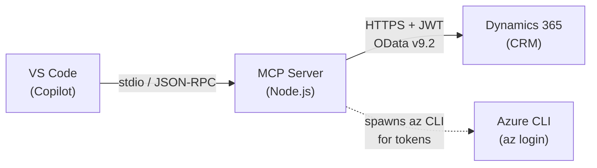

[← Back to Docs Index](README.md)

# MSX MCP Server — Architecture Guide

> A plain-language walkthrough of how the MSX MCP server works, why it's built the way it is, and what to watch out for.

**TL;DR** — This server sits between your AI editor and Dynamics 365 CRM. It authenticates via Azure CLI, enforces an entity allowlist, stages all writes for human approval, and optimizes responses to keep AI context windows small. If you read one doc, read this one.

## What This Server Does

The MSX MCP server gives AI agents (like GitHub Copilot) the ability to read and write data in **Microsoft Dynamics 365 CRM** — the system Microsoft sellers use to manage opportunities, milestones, and tasks. It speaks the [Model Context Protocol (MCP)](https://modelcontextprotocol.io), which is how VS Code and other editors communicate with tool servers.

In short: you ask Copilot a question about your CRM data, Copilot calls a tool on this server, the server talks to Dynamics 365, and the answer comes back.



## Source File Map

| File | Purpose |
|---|---|
| `src/index.js` | Entry point. Wires together auth, CRM client, and MCP server. |
| `src/auth.js` | Gets access tokens from Azure CLI (`az account get-access-token`). |
| `src/crm.js` | HTTP client for Dynamics 365 OData API. Handles retries, pagination, and token refresh. |
| `src/tools.js` | All MCP tool definitions — this is where the business logic lives. |
| `src/validation.js` | Input sanitization: GUID validation, OData string escaping. |
| `src/approval-queue.js` | In-memory queue that stages write operations for human review before execution. |
| `src/audit.js` | Structured logging (NDJSON to stderr) for every tool invocation. |

## How Authentication Works

The server does **not** store any credentials. It delegates authentication entirely to the Azure CLI:

1. You run `az login` once on your machine (signs in with your Microsoft corp account).
2. When the server needs a CRM token, it spawns `az account get-access-token --resource https://microsoftsales.crm.dynamics.com`.
3. The CLI returns a JWT. The server caches it until it expires (~60 min), then refreshes automatically.
4. If the token expires mid-session, the server detects the 401 response, clears the cache, gets a fresh token, and retries the request — transparent to the agent.

**Why Azure CLI?** It reuses your existing login, works across platforms, and avoids putting client secrets into config files. The tradeoff is it requires the CLI to be installed and authenticated locally.

### Token Lifecycle

```
Agent calls a tool
  → server checks cached token
    → if valid → use it
    → if expired/missing → spawn `az account get-access-token`
      → cache new token
  → make CRM request
    → if 401 → clear cache, get fresh token, retry once
```

## How CRM Requests Work

The CRM client (`crm.js`) is a thin wrapper over the Dynamics 365 OData v9.2 API. Key behaviors:

- **Retry logic** — Retries on 408, 429, 500, 502, 503, 504. Respects `Retry-After` headers. Write operations (POST/PATCH/DELETE) get up to 3 retries with exponential backoff. Reads don't retry by default (they're idempotent but we optimize for speed).
- **Auto-pagination** — If Dynamics returns an `@odata.nextLink`, the client follows it automatically, collecting all pages into a single result.
- **Pagination ceiling** — `crm_query` caps at **500 records** across all pages. This prevents runaway queries from blowing up the agent's context window.
- **Timeouts** — 20-second default per request. Long enough for CRM, short enough to not hang the agent.

### Entity Allowlist

The generic query tools (`crm_query` and `crm_get_record`) don't let you query arbitrary Dynamics 365 entities. They enforce an **allowlist** defined in `ALLOWED_ENTITY_SETS` at the top of `tools.js`:

```
accounts, contacts, opportunities, msp_engagementmilestones, msp_dealteams,
msp_workloads, tasks, systemusers, transactioncurrencies, connections,
connectionroles, processstages, EntityDefinitions
```

If an agent (or a prompt injection) tries to query an entity not on this list, the request is **blocked before it ever reaches CRM** and an audit log entry is written. The error message tells the agent exactly which entities are allowed, so it can self-correct.

Purpose-built tools like `get_milestones` and `list_opportunities` bypass the allowlist because they already hardcode their entity paths — the agent can't redirect them to a different entity.

**Why this matters:** Dynamics 365 orgs contain hundreds of entity sets, many with sensitive data (HR records, financial details, internal configs). The allowlist restricts the attack surface to only the entities the server is designed to work with.

## Tools: The Agent-Facing API

Tools are registered in `tools.js` and fall into three categories:

### Read Tools
These query CRM and return data. No side effects.

| Tool | What it does |
|---|---|
| `crm_whoami` | "Am I authenticated?" — returns your user ID |
| `crm_auth_status` | Token health check (user, expiry, CRM URL) |
| `crm_query` | Generic OData query against an allowed entity set |
| `crm_get_record` | Fetch a single record by GUID |
| `list_opportunities` | Opportunities by account IDs or customer name |
| `get_my_active_opportunities` | Your owned + deal-team opportunities |
| `get_milestones` | Milestones with flexible scoping (customer, opportunity, owner, etc.) |
| `get_milestone_activities` | Tasks linked to milestones |
| `find_milestones_needing_tasks` | Composite: finds milestones without any linked tasks |
| `list_accounts_by_tpid` | Accounts by Top Parent ID |
| `get_milestone_field_options` | Picklist values from CRM metadata |
| `get_task_status_options` | Valid task status codes |

### Visualization Tools
These return data with **render hints** — structured metadata the Copilot UI can use to display charts, timelines, and diff tables.

| Tool | What it returns |
|---|---|
| `view_milestone_timeline` | Milestone events sorted by date, with timeline layout hints |
| `view_opportunity_cost_trend` | Monthly cost/consumption data with chart hints |
| `view_staged_changes_diff` | Before/after comparison table for staged writes |

### Write Tools (All Staged)
Every CRM write goes through a **stage → review → execute** flow. Nothing hits CRM until you say "execute."

| Tool | What it stages |
|---|---|
| `create_milestone` | New milestone on an opportunity |
| `create_task` | New task linked to a milestone |
| `update_task` | Field changes on an existing task |
| `close_task` | Task closure via CloseTask action |
| `update_milestone` | Field changes on a milestone (with ownership verification) |

### Approval Queue Tools
These manage the staged write operations:

| Tool | Action |
|---|---|
| `list_pending_operations` | See what's staged |
| `execute_operation` | Execute one by ID |
| `execute_all` | Execute everything in queue |
| `cancel_operation` | Discard one |
| `cancel_all` | Discard everything |

## Optimizations for Agentic Use

AI agents have a key constraint that humans don't: **context window size**. Every tool call's input and output counts against the model's token budget. The server is designed to minimize the number of round-trips and the size of each response.

### 1. Composite Tools (Reduce Call Chains)

Without composite tools, an agent answering "show me milestones for Contoso" would need:

```
Call 1: list_opportunities({ customerKeyword: "Contoso" })  →  get opportunity GUIDs
Call 2: get_milestones({ opportunityId: "guid-1" })          →  milestones for opp 1
Call 3: get_milestones({ opportunityId: "guid-2" })          →  milestones for opp 2
Call 4: get_milestone_activities({ milestoneIds: [...] })     →  tasks
```

That's 4 round-trips. Each one burns tokens on the request, the response, and the model reasoning about what to do next.

Instead, `get_milestones` accepts a `customerKeyword` parameter and does the entire chain internally:

```
Call 1: get_milestones({ customerKeyword: "Contoso", includeTasks: true })
  Internally: accounts → opportunities → milestones → tasks
  Returns: everything in one response
```

**1 call instead of 4.** The server does the multi-hop resolution server-side so the agent doesn't have to.

### 2. Response Format Options

`get_milestones` supports three output formats via the `format` parameter:

- **`full`** (default) — Complete milestone records with all OData fields and annotations. Use when the agent needs to inspect specific fields.
- **`summary`** — Grouped counts (by status, commitment, opportunity) plus compact milestone objects. Good for "give me an overview."
- **`triage`** — Urgency-classified buckets: `overdue`, `due_soon`, `blocked`, `on_track`. Ideal for morning briefs — the agent gets a pre-sorted action list rather than raw data to sort itself.

The triage format also **strips OData annotations** (the verbose `@OData.Community.Display.V1.FormattedValue` keys), significantly reducing token count per milestone.

### 3. Selective `$select` Fields

The server uses curated `$select` lists for milestones and opportunities — only the fields that are actually useful. The Dynamics 365 API returns *every* field by default, including dozens of system-managed columns. Without `$select`, a single milestone record can be 3-5x larger.

### 4. Embedded Picklist Labels

CRM stores picklist values as opaque numbers (e.g., `861980000` for "On Track"). Normally the agent would need a separate metadata call to translate these. The server embeds the most common picklist mappings directly in the code and resolves labels inline — no extra round-trip needed.

### 5. Pagination Guards

The **500-record pagination ceiling** on `crm_query` prevents an unscoped query from returning thousands of records that would overflow the context window. The tool description tells the agent exactly what the limit is, so it can adjust its query strategy.

### 6. Entity Allowlist

`crm_query` and `crm_get_record` only allow queries against a declared set of entity sets (`ALLOWED_ENTITY_SETS`). This isn't just a security measure — it prevents the agent from querying unfamiliar entities that return huge, unstructured payloads. If the agent asks for an entity that isn't on the list, it gets a clear error with the full list of allowed sets.

### 7. Scoped Milestone Queries

`get_milestones` **rejects unscoped calls**. You must provide at least one of: `customerKeyword`, `opportunityKeyword`, `opportunityId`, `opportunityIds`, `milestoneNumber`, `milestoneId`, `ownerId`, or `mine: true`. This prevents "give me all milestones in the org" queries that would return massive payloads.

## The Staged Write Pattern

Every write operation follows this flow:

```
1. Agent calls a write tool (e.g., update_milestone)
2. Server validates inputs
3. Server fetches the current record state (before-state)
4. Server stages the operation in an in-memory approval queue
5. Server returns a preview: { staged: true, before: {...}, after: {...} }
6. User reviews the diff
7. User says "execute" → agent calls execute_operation
8. Server sends the actual PATCH/POST to CRM
9. Server confirms success
```

**Why?** CRM is production data. A misunderstood prompt could update the wrong milestone or set incorrect values. The staging pattern ensures a human sees exactly what will change before it happens. The approval queue also has a **10-minute TTL** — staged operations expire automatically if not acted on.

For milestone updates specifically, the server also performs **ownership verification** (are you the milestone owner or on the deal team?) and **pre-execution identity checks** (is the milestone number still what we expect?) to guard against targeting the wrong record.

## Known Limitations

### Local Environment Required

This server is designed to run on your **local machine** — the same machine where you've signed into Azure CLI. It will not work out-of-the-box in:

- **Azure Virtual Desktop (AVD)** — The MCP server runs as a child process of VS Code. In AVD/remote desktop scenarios, the `az` CLI may not be installed or authenticated in the remote environment, and the stdio transport may not traverse the remote connection reliably.
- **VS Code Remote / SSH** — When using Remote-SSH or Remote-Tunnels, VS Code runs extensions on the remote host. The remote machine needs Azure CLI installed and authenticated separately — your local `az login` session doesn't carry over.
- **GitHub Codespaces / Dev Containers** — Same issue: the container needs its own `az login`. You'd need to configure Azure CLI auth inside the container, which can be done but requires extra setup.
- **Web-based VS Code (vscode.dev)** — MCP servers require a local Node.js process. Browser-only environments can't spawn child processes.

**For the best experience:** Run VS Code locally on a machine where you have Azure CLI installed, are signed in with your Microsoft corp account (`az login`), and that account has Dynamics 365 API permissions for the CRM org.

### Identity and Permissions

Your CRM access is determined by your Azure AD identity. If you can't see certain opportunities or milestones in MSX, you won't see them through this server either — CRM enforces the same row-level security.

The server doesn't elevate permissions or bypass any CRM access controls. What you see is what you get.

### In-Memory State

The approval queue and audit log live in memory. If the MCP server process restarts (which happens when VS Code restarts the MCP client), all pending staged operations are lost. This is by design — it keeps the server stateless and simple — but it means you shouldn't stage a bunch of writes and then walk away without executing them.

### Network Dependencies

The server makes HTTPS calls to Dynamics 365 on every tool invocation. If you're on a slow VPN or the CRM API is experiencing latency, tool calls will be slower. The 20-second timeout per request exists to prevent indefinite hangs, but a slow CRM API will still make the agent feel sluggish.

---

## What to Read Next

- **[Staged Operations](STAGED_OPERATIONS.md)** — Deep dive into the human-in-the-loop write flow: how operations are staged, previewed, approved, and executed.
- **[Milestone Lookup Optimization](MILESTONE_LOOKUP_OPTIMIZATION.md)** — How `get_milestones` consolidates multi-hop CRM lookups into single tool calls to save tokens and round-trips.
- **[Main README](../README.md)** — Quick start guide, setup instructions, and full tool reference.
