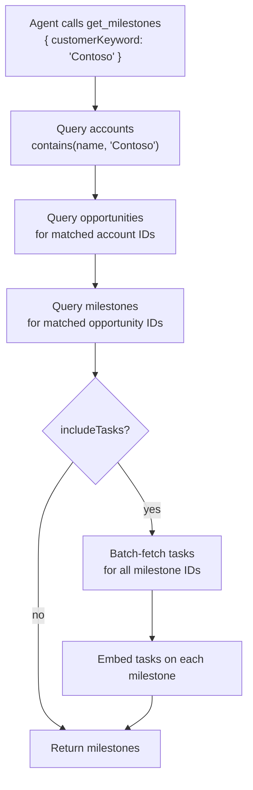

[← Back to Docs Index](README.md)

# Milestone Lookup Optimization

> **Prerequisite reading:** [Architecture Guide](ARCHITECTURE.md) — covers how tools work and why minimizing round-trips matters.

**TL;DR** — `get_milestones` resolves customer names, opportunity names, and task data all in a single tool call. What used to take 2–4 chained API calls now takes 1. Use `customerKeyword`, `opportunityKeyword`, and `includeTasks: true` to get everything in one shot.

> How `get_milestones` consolidates multi-step CRM lookups into single tool calls.

## The Problem It Solves

AI agents pay a cost for every tool call — a round-trip through model → MCP → CRM, plus tokens for the request and response. Before this optimization, answering "show me milestones for Contoso" required multiple chained calls:

```
Call 1: list_opportunities({ customerKeyword: "Contoso" })    →  opportunity GUIDs
Call 2: get_milestones({ opportunityId: "<guid1>" })          →  milestones for opp 1
Call 3: get_milestones({ opportunityId: "<guid2>" })          →  milestones for opp 2
Call 4: get_milestone_activities({ milestoneIds: [...] })     →  tasks
```

Each call burns tokens on input, output, and the model deciding what to do next. Worse, agents sometimes struggled with the name-to-GUID resolution step and wasted calls on retries.

## What Changed

`get_milestones` now handles the entire resolution chain server-side. Three parameters make this work:

| Parameter | What it does internally |
|---|---|
| `customerKeyword` | Resolves customer name → accounts → opportunities → milestones in one call |
| `opportunityKeyword` | Resolves opportunity name → matching opportunities → milestones in one call |
| `includeTasks` | When `true`, batch-fetches tasks and embeds them inline on each milestone |

### Resolution Flow (customerKeyword)



All of this happens inside a single tool invocation. The agent sees one call and one response.

### Call Count Comparison

| Scenario | Before | Now |
|---|---|---|
| Milestones for customer "Contoso" | 2–4 calls | **1 call** |
| Milestones for opportunity "Azure Migration" | 2 calls | **1 call** |
| Milestones + tasks for a customer | 3–4 calls | **1 call** |
| Milestones by opportunity GUID | 1 call | 1 call (unchanged) |
| My milestones (`mine: true`) | 1 call | 1 call (unchanged) |

## Response Formats

The `format` parameter controls how much processing the server does before returning results:

- **`full`** (default) — Complete milestone records with all selected OData fields.
- **`summary`** — Grouped counts (by status, commitment, opportunity) plus compact milestone objects.
- **`triage`** — Urgency-classified buckets: `overdue`, `due_soon`, `blocked`, `on_track`. OData annotations are stripped for smaller payloads.

### Example: Triage Format

```json
{
  "summary": { "total": 5, "overdue": 1, "due_soon": 2, "blocked": 0, "on_track": 2 },
  "overdue": [{ "name": "SQL Migration", "date": "2026-02-28", "status": "On Track", ... }],
  "due_soon": [...],
  "blocked": [],
  "on_track": [...]
}
```

### Example: With Inline Tasks

```json
{
  "count": 5,
  "milestones": [
    {
      "msp_engagementmilestoneid": "...",
      "msp_name": "SQL DB for AI-based Intelligence app",
      "status": "On Track",
      "commitment": "Uncommitted",
      "msp_milestonedate": "2027-01-31",
      "msp_monthlyuse": 3000,
      "opportunity": "Contoso Azure Modernization",
      "tasks": [
        {
          "activityid": "...",
          "subject": "Architecture review",
          "scheduledend": "2027-01-15",
          "statuscode": 2
        }
      ]
    }
  ]
}
```

When `includeTasks` is `false` (default), the `tasks` key is omitted entirely — no extra CRM calls are made.

## Scoping Requirement

`get_milestones` **rejects unscoped calls**. You must provide at least one of:

- `customerKeyword` or `opportunityKeyword` (name-based resolution)
- `opportunityId` or `opportunityIds` (GUID-based)
- `milestoneId` or `milestoneNumber` (direct lookup)
- `ownerId` or `mine: true` (owner-based)

This prevents "return all milestones in the org" queries that would produce massive payloads.

## Additional Filters

These can be combined with any scoping parameter:

| Parameter | Effect |
|---|---|
| `statusFilter: 'active'` | Keeps only Not Started / On Track / Blocked / At Risk |
| `keyword` | Case-insensitive text filter across milestone name, opportunity, and workload |
| `taskFilter: 'without-tasks'` | Only milestones that have no linked tasks |
| `taskFilter: 'with-tasks'` | Only milestones that have linked tasks |

## Relationship to Other Tools

| Tool | When to use it instead |
|---|---|
| `find_milestones_needing_tasks` | Convenience wrapper — equivalent to `get_milestones({ customerKeyword, taskFilter: 'without-tasks' })` but accepts multiple customer keywords in one call |
| `get_milestone_activities` | When you need tasks for milestones you already have (e.g., from a previous `crm_query`). For new queries, prefer `includeTasks: true` on `get_milestones` |
| `list_opportunities` | When you need opportunity details without milestones. For milestones, go straight to `get_milestones({ customerKeyword })` |

---

## What to Read Next

- **[Architecture Guide](ARCHITECTURE.md)** — Full server overview including the composite tools pattern and response format optimizations.
- **[Staged Operations](STAGED_OPERATIONS.md)** — Once you've queried milestones, learn how updating them works through the staged write flow.
- **[Main README](../README.md)** — Quick start guide, setup instructions, and full tool reference.
