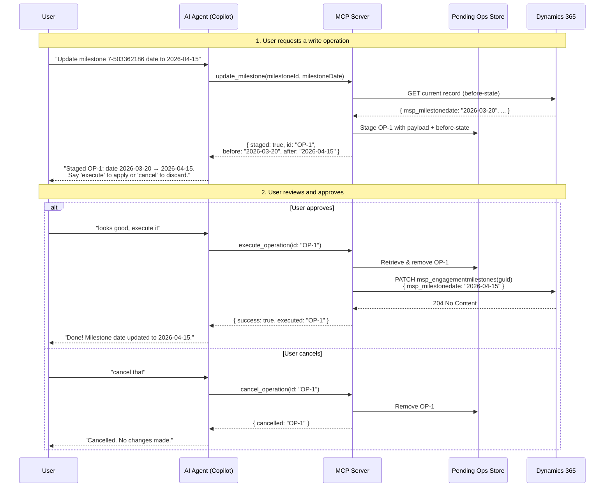
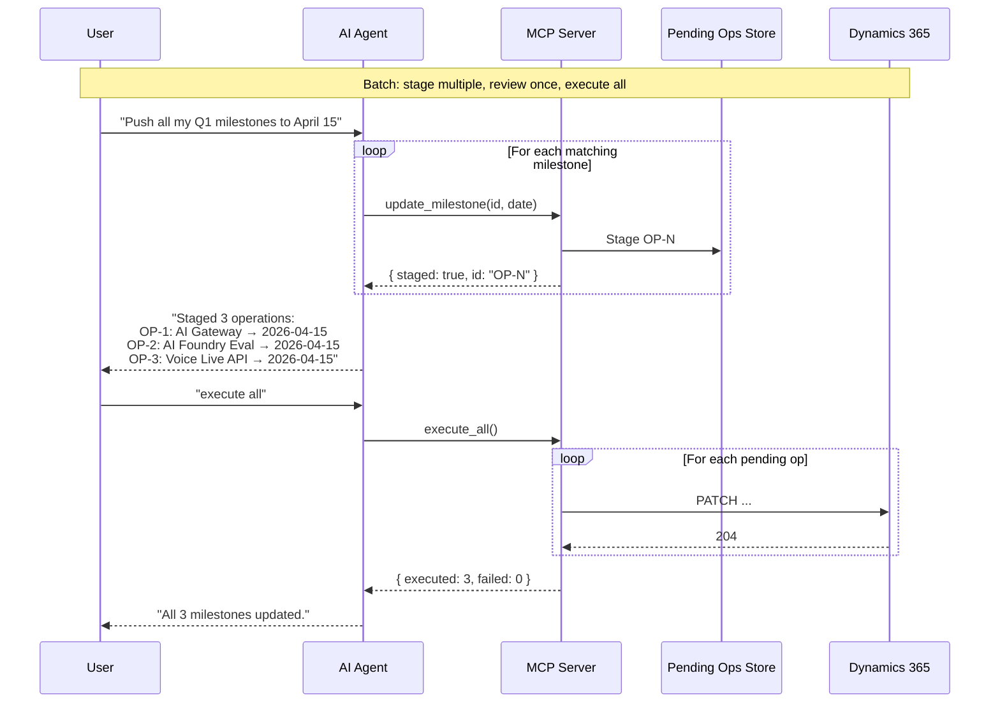

[← Back to Docs Index](README.md)

# Staged Operations — Human-in-the-Loop Write Flow

> **Prerequisite reading:** [Architecture Guide](ARCHITECTURE.md) — covers authentication, CRM requests, and the tool categories.

**TL;DR** — Every CRM write (create, update, close) is staged in memory first. You see a before/after preview, then explicitly approve or cancel. Nothing touches CRM until you say "execute." Operations expire after 10 minutes if not acted on.

## Problem

CRM is sensitive production data. Users need to update milestones, tasks, and other records as part of their daily workflow, but accidental or incorrect writes could be costly. We need a pattern that is **easy to use** while ensuring **every write is explicitly approved**.

## Solution: Stage → Review → Execute

Write tools don't touch CRM immediately. Instead they **validate + stage** the change, return a preview, and wait for the user to approve before executing.

```
User  →  "update milestone 7-503362186 date to 2026-04-15"
  ↓
AI calls update_milestone  →  stages the change, returns preview
  ↓
User sees:  "Staged OP-1: update msp_milestonedate 2026-03-20 → 2026-04-15"
  ↓
User  →  "looks good, execute it"   (or "cancel that")
  ↓
AI calls execute_operation(id: "OP-1")  →  PATCH sent to CRM
```

## Sequence Diagram — Single Operation



## Sequence Diagram — Batch Operations



## Architecture

### Approval Queue (`approval-queue.js`)

Non-blocking `EventEmitter`-based queue. Write tools stage operations into the queue and return immediately so the agent can continue working. The queue emits events that frontends or agent flows can subscribe to for approval/rejection.

```js
import { getApprovalQueue } from './approval-queue.js';

const queue = getApprovalQueue();

// Subscribe to queue events from any consumer (frontend, IPC, agent)
queue.on('staged',   (op)         => { /* show approval card in UI */ });
queue.on('approved', (op)         => { /* update UI state */ });
queue.on('rejected', (op)         => { /* dismiss card */ });
queue.on('executed', (op, result) => { /* show success toast */ });
queue.on('expired',  (op)         => { /* show expiry notice */ });
queue.on('error',    (op, err)    => { /* show error, op reset to pending for retry */ });
```

Operations expire after a configurable TTL (default: 10 minutes).

```
StagedOperation {
  id:          string       // "OP-1", "OP-2", ...
  type:        string       // "update_milestone", "create_task", etc.
  entitySet:   string       // CRM entity path for the request
  method:      string       // "POST" | "PATCH"
  payload:     object       // Request body to send
  beforeState: object|null  // Snapshot of current record (for diff preview)
  description: string       // Human-readable summary
  stagedAt:    string       // ISO timestamp
  expiresAt:   number       // Unix ms when this op expires
  status:      'pending' | 'approved' | 'rejected' | 'executed' | 'expired'
}
```

### New MCP Tools

| Tool | Purpose |
|------|---------|
| `list_pending_operations` | Show all staged changes awaiting approval |
| `execute_operation` | Execute a single staged operation by ID |
| `execute_all` | Execute all pending operations in sequence |
| `cancel_operation` | Discard a staged operation by ID |
| `cancel_all` | Discard all pending operations |

### Modified Write Tools

Existing write tools (`create_task`, `update_task`, `close_task`, `update_milestone`) change behavior:

1. **Validate** inputs (same as today)
2. **Fetch before-state** from CRM (GET the current record)
3. **Stage** the operation in the pending store
4. **Return preview** with before → after diff and the operation ID

No CRM writes happen until `execute_operation` or `execute_all` is called.

## Why This Works for MCP

| Concern | How it's addressed |
|---------|-------------------|
| Accidental writes | Nothing writes until `execute_operation` is called |
| Human-in-the-loop | AI shows the staged preview; user says "go" or "cancel" |
| Batch updates | User stages multiple changes, reviews all, executes in one shot |
| Audit trail | Easy to add logging in `execute_operation` |
| Day-to-day ease | Natural conversation flow — no extra forms or UI |
| Undo window | Staged ops sit until reviewed; `cancel_operation` discards |
| Stale writes | TTL expiry auto-discards operations after 10 minutes |

## Future Enhancements

- **Before-state diff**: Show old → new values in the preview for every field
- **Audit log**: Persist executed operations to a local file for traceability
- **Undo**: After `execute_operation`, store the before-state so a follow-up "undo" can revert
- **Configurable TTL**: Allow users to set expiry via environment variable

---

## What to Read Next

- **[Architecture Guide](ARCHITECTURE.md)** — Full server overview including authentication, entity allowlists, and all tool categories.
- **[Milestone Lookup Optimization](MILESTONE_LOOKUP_OPTIMIZATION.md)** — How read-side milestone queries are consolidated into single tool calls.
- **[Main README](../README.md)** — Quick start guide, setup instructions, and full tool reference.
