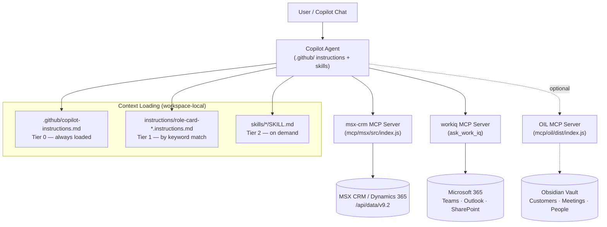
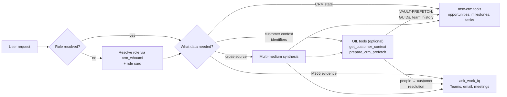
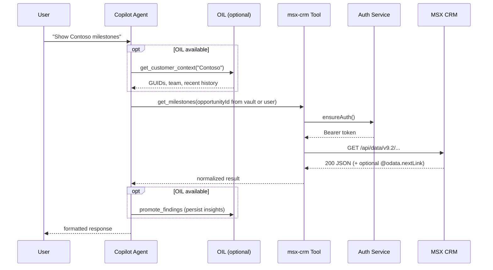
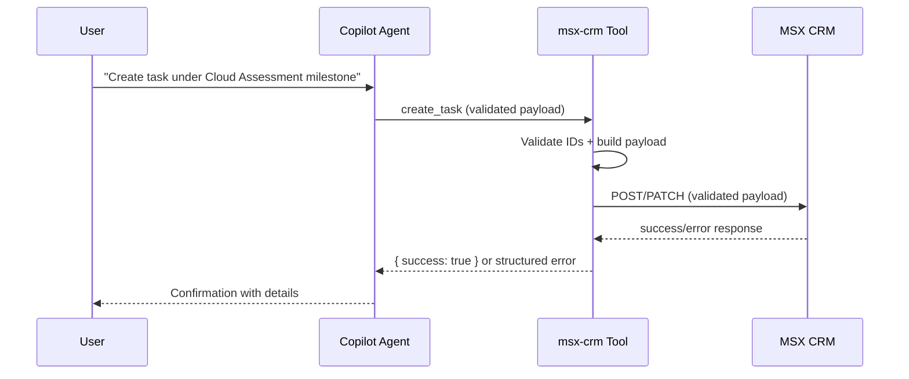
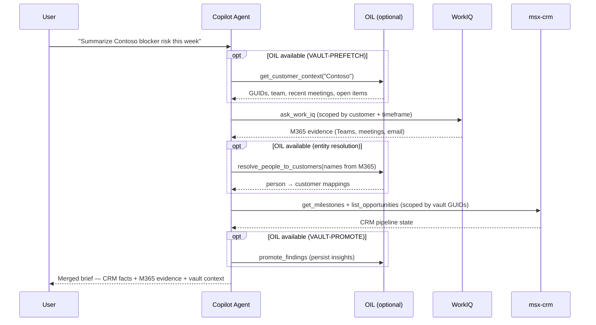

# MCAPS Copilot Tools — Architecture

This document describes how the three MCP servers — **MSX CRM**, **WorkIQ**, and **OIL (optional)** — compose into a unified workflow orchestrated by Copilot. Each server owns a single domain; Copilot orchestrates across them using role cards and atomic skills.

## System Overview

### How the servers compose

| Server | Domain | Data Direction | What it provides |
|---|---|---|---|
| **msx-crm** | CRM system of record | Read / Write (staged) | Opportunities, milestones, tasks, owners, pipeline state |
| **workiq** | M365 collaboration evidence | Read only | Teams chats, meeting transcripts, emails, SharePoint docs |
| **OIL** *(optional)* | Durable knowledge layer | Read / Write (gated) | Customer context, relationship graphs, meeting history, agent insights, CRM identifier bridge |

Copilot **orchestrates** — each MCP server stays focused on its domain. OIL never calls CRM or M365 internally; instead, Copilot uses OIL to resolve identifiers (VAULT-PREFETCH), then routes to CRM/WorkIQ with scoped queries.

## Local Filesystem as Orchestration Substrate

For this repository, orchestration state is intentionally local-first and workspace-bound.

- **Obsidian vault** (via OIL — `oil` MCP server) is the durable knowledge layer — customer context, decisions, agent insights, and Connect hooks are persisted here. See [`.github/instructions/obsidian-vault.instructions.md`](../.github/instructions/obsidian-vault.instructions.md) for the full vault protocol.
- `.vscode/mcp.json` is the MCP baseline and `.vscode/mcp.runtime.overlay.json` is runtime delta.
- Copilot CLI session continuity relies on these files, not a remote persistence service.

### Configuring Your Own Knowledge Layer

The vault is optional. Without it, the agent operates statelessly (CRM-only). If you want persistent cross-session memory, you can:

1. **Use OIL** (recommended) — configure the `oil` MCP server in `.vscode/mcp.json`. See the [README](../README.md#optional-enable-obsidian-vault-integration) for setup. OIL provides 22 domain-specific tools with pre-indexed search, context-aware composites, and gated writes.
2. **Bring your own MCP server** — any MCP server that provides read/write note operations works. Wire it into `.vscode/mcp.json` and update [`.github/copilot-instructions.md`](../.github/copilot-instructions.md) to tell the agent how to use it.
3. **Use Copilot instructions** — the agent's behavior is shaped by instruction files. See these examples for how persistence is wired into agent workflows:
   - [`.github/copilot-instructions.md`](../.github/copilot-instructions.md) — Tier 0 always-loaded rules, including the Knowledge Layer section
   - [`.github/instructions/obsidian-vault.instructions.md`](../.github/instructions/obsidian-vault.instructions.md) — how vault reads/writes integrate with CRM workflows (VAULT-PREFETCH, VAULT-PROMOTE, etc.)
   - [`.github/instructions/intent.instructions.md`](../.github/instructions/intent.instructions.md) — how the agent reasons across multiple mediums (CRM, M365, vault)

### Reliability Constraints

- Use atomic file updates for JSON state artifacts (write temp then rename).
- Guard concurrent writes with per-resource locks and deterministic same-thread queue behavior.
- Validate and sanitize all filesystem paths to remain under repo root.
- If a persistence file is corrupt/unavailable, continue read-only/degraded and surface diagnostics.

## MCP Routing Model (Recommended)

### Routing rules

- Use **msx-crm** tools for structured CRM entities and write-intent planning:
  - opportunities, milestones, tasks, owners, statuses, dates, and dry-run updates.
- Use **WorkIQ** MCP (`ask_work_iq`) for M365 collaboration evidence:
  - Teams chats/channels, meeting transcripts/notes, Outlook email/calendar, SharePoint/OneDrive files.
- Use **OIL** (when available) for durable context and scoping:
  - `get_customer_context` for VAULT-PREFETCH before CRM queries (provides GUIDs, team, history).
  - `resolve_people_to_customers` for entity resolution between WorkIQ passes.
  - `promote_findings` to persist agent insights for future sessions.
  - `search_vault` for semantic search across customer knowledge.
- Keep systems distinct in outputs:
  - CRM = system-of-record state.
  - WorkIQ = supporting evidence and context.
  - Vault = durable knowledge and context bridge.
- **Without OIL**: agent operates statelessly — CRM and WorkIQ still work, but queries are unscoped (no VAULT-PREFETCH) and insights are not persisted between sessions.

## Role-Skill Binding + Context Stack Transparency

- Role identity is resolved by matching the user's self-identified role to a **role card** under `.github/instructions/role-card-*.instructions.md`.
- Once the role is resolved, Copilot activates relevant **atomic skills** from `.github/skills/*/SKILL.md` based on keyword matching against the request.
- The original monolithic role skills (e.g., `Solution_Engineer_SKILL.md`) are archived in `.github/skills/_legacy/` — see the [legacy README](../.github/skills/_legacy/README.md) for the decomposition mapping.
- Execution context should explicitly include the resolved role card and active skills alongside user prompt and repo instructions.
- UI should expose a collapsible Context Stack panel showing:
  - active role card and mapped atomic skills,
  - key prompt/context blocks used for orchestration,
  - provenance labels (`user input`, `repo instruction`, `skill`, `derived`).

## MSX CRM Read Path

Read tools call `crmClient.request(...)` or `crmClient.requestAllPages(...)`, which:
- Ensure auth through `authService.ensureAuth()`.
- Build CRM OData URL: `<crmUrl>/api/data/v9.2/<entityPath>`.
- Execute GET with retry/timeout handling.
- Return parsed JSON payload to MCP client.

### Primary Read Tools
- `crm_auth_status`, `crm_whoami`
- `crm_query`, `crm_get_record`
- `list_accounts_by_tpid`, `list_opportunities`
- `get_milestones`, `get_milestone_activities`
- `get_task_status_options`

## MSX CRM Update Path

Update-oriented tools validate inputs and execute CRM write operations.

### Update-Oriented Tools
- `create_task`
- `update_task`
- `close_task`
- `update_milestone`

## Planned Approval-Based Write Flow

`mcp/msx/STAGED_OPERATIONS.md` describes a staged pattern (`stage -> review -> execute`) for safe production writes:
- Stage operation with preview.
- User approves/cancels.
- Execute approved operation against CRM.

This is design guidance and not yet wired into `src/tools.js`.

## Key Implementation Files

### MSX CRM Server (`mcp/msx/`)
- `src/index.js` — server bootstrap and stdio transport.
- `src/tools.js` — MCP tool contracts and dry-run update behavior.
- `src/auth.js` — Azure CLI token acquisition and token metadata.
- `src/crm.js` — OData request layer, retries, pagination.

### OIL Server (`mcp/oil/`) — optional
- `src/index.ts` — server bootstrap and stdio transport.
- `src/tools/orient.ts` — orient tools (get_vault_context, get_customer_context, etc.).
- `src/tools/retrieve.ts` — retrieve tools (search_vault, prepare_crm_prefetch, etc.).
- `src/tools/write.ts` — gated write tools (promote_findings, etc.).
- `src/tools/composite.ts` — cross-domain composite operations.
- `src/graph.ts` — in-memory knowledge graph from vault wikilinks.
- `src/search.ts` — 3-tier search (lexical → fuzzy → semantic).

## Cross-Source Workflow (CRM + WorkIQ + Vault)

When user asks for cross-source evidence (for example, "summarize customer blockers from meetings + Teams + docs + email"):

### Steps
1. **VAULT-PREFETCH** (if OIL available) — resolve customer identifiers, team, and history from vault.
2. **WorkIQ retrieval** — scoped M365 search using vault-provided context.
3. **Entity resolution** (if OIL available) — map people from M365 results to vault customers.
4. **CRM read** — scoped queries using vault-provided GUIDs.
5. **VAULT-PROMOTE** (if OIL available) — persist agent findings for future sessions.
6. Return a joined output with explicit sections for `CRM facts`, `M365 evidence`, and (optionally) `Vault context`.

**Without OIL:** Steps 1, 3, and 5 are skipped. CRM queries use user-provided identifiers instead of vault-resolved GUIDs. Insights are not persisted.

## Copilot CLI Example Flow (Simple)

Use this when you want one practical loop with minimal setup overhead.

1. Open Copilot CLI in this repo (`copilot`) where MCP servers are already configured.
2. State role + objective in one line (example: “Role: Solution Engineer. Summarize blocker risk for Contoso this week.”).
3. If OIL is available, Copilot auto-runs `get_customer_context` for VAULT-PREFETCH.
4. Ask for WorkIQ evidence first (`ask_work_iq`) limited to timeframe + source types.
5. Ask for CRM facts second (`msx-crm` milestones/tasks/opportunity status).
6. Ask for a final merged brief in sections: `CRM facts`, `M365 evidence`, and `Vault context` (if OIL active).

For write-intent changes, keep the same flow but require explicit approval before any create/update/close action.

## References

- WorkIQ overview: https://learn.microsoft.com/en-us/microsoft-365-copilot/extensibility/workiq-overview
