# Evaluation Framework — Architecture & Implementation Guide

> **Status**: Implemented (Phase 1 + Phase 2 + Phase 3 regression tracking)  
> **Last verified**: 2026-03-16 — baseline 92.9%, live 94.0%  
> Companion to [Design Spec](design-spec.md) (design goals), [Hardening](hardening.md) (hardening), [Regression & Test Data](regression-data.md) (regression & test data).  
> This document covers **how the code works**: runtime flow, mock infrastructure, judges, fixtures, the live agent loop, regression tracking, and the fixture generator pipeline.

---

## Overview

The eval framework has two phases that share the same judges and fixture data:

| Phase | Runner | LLM Required | Cost | Purpose |
|---|---|---|---|---|
| **Phase 1 — Offline** | `npm run eval` | No | Free | Fast, deterministic checks against hand-crafted tool-call traces |
| **Phase 2 — Live** | `npm run eval:live` | Yes (Azure OpenAI) | ~$0.005–$0.05/scenario | End-to-end agent loop with mock MCP servers + LLM-as-judge |

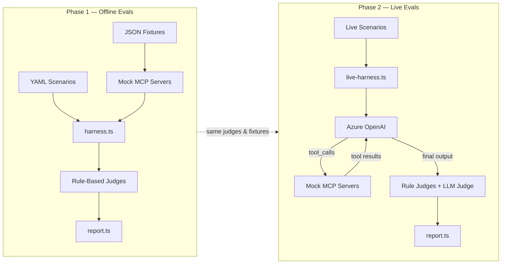

---

## Directory Structure

```
evals/
├── harness.ts                      # Core types, mock servers, scoring engine (533 lines)
├── report.ts                       # Markdown report & aggregation (92 lines)
├── fixtures/
│   ├── scenarios/                  # YAML-defined test scenarios
│   │   ├── skill-routing.yaml      # 15 routing test cases
│   │   ├── tool-correctness.yaml   # 5 tool sequence scenarios
│   │   ├── anti-patterns.yaml      # 9 anti-pattern definitions
│   │   ├── output-format.yaml      # Output schema validations
│   │   └── live-scenarios.yaml     # 5 live agent E2E scenarios
│   ├── generators/                 # Synthetic fixture factories
│   │   ├── crm-factory.ts          # CRM fixture builder (5 presets)
│   │   ├── oil-factory.ts          # Vault fixture builder (2 presets)
│   │   ├── m365-factory.ts         # M365 fixture builder (2 presets)
│   │   ├── schema-guard.ts         # Shape validation & drift detection
│   │   └── index.ts                # Barrel exports
│   ├── scrub-map.json              # Customer/user name redaction mapping
│   ├── crm-responses/              # Mock CRM JSON payloads (gitignored)
│   │   ├── whoami.json             # User identity (Jin Lee, CSA)
│   │   ├── opportunities-contoso.json
│   │   ├── milestones-active.json
│   │   ├── tasks-active.json
│   │   └── ... (~11 files total)
│   ├── oil-responses/              # Mock OIL JSON payloads (gitignored)
│   │   ├── vault-context.json
│   │   ├── customer-context-*.json
│   │   └── ... (~10 files total)
│   └── m365-responses/             # Mock M365 JSON payloads (gitignored)
│       ├── calendar-today.json
│       └── workiq-meetings.json
├── judges/
│   ├── tool-sequence.ts            # Tool presence, params, ordering (181 lines)
│   ├── anti-pattern.ts             # AP-001 through AP-010, severity-weighted (368 lines)
│   ├── output-format.ts            # Section/column/table validation (132 lines)
│   └── llm-judge.ts               # Azure OpenAI subjective scoring w/ retry (261 lines)
├── reporters/
│   └── json-persist.ts             # Vitest custom reporter → JSON results (172 lines)
├── results/
│   ├── baseline.json               # Committed baseline (92.9%, 7 scenarios)
│   ├── latest.json                 # Gitignored — most recent run
│   └── history/                    # Gitignored — timestamped run archive
├── traces/
│   ├── README.md                   # Trace format documentation
│   ├── types.ts                    # AgentTrace interface (53 lines)
│   ├── trace-harness.ts            # Capture/promote/regression CLI (293 lines)
│   └── golden/                     # Committed human-verified traces
├── anti-patterns/
│   └── anti-patterns.eval.ts       # AP detection unit tests (306 lines)
├── context-budget/
│   └── context-budget.eval.ts      # Token budget calculations (165 lines)
├── output-format/
│   └── output-format.eval.ts       # Format compliance tests (167 lines)
├── routing/
│   └── routing.eval.ts             # Skill trigger phrase routing (185 lines)
├── tool-correctness/
│   └── tool-calls.eval.ts          # Tool sequence simulations (316 lines)
└── live/
    ├── config.ts                   # Model profiles & env config (93 lines)
    ├── live-harness.ts             # System prompt assembly + agent loop (843 lines)
    └── live-agent.eval.ts          # 5 E2E live scenarios + LLM judge (320 lines)

scripts/
├── eval-persist.js                 # Baseline/diff/history CLI (256 lines)
├── sync-mock-tools.js              # Auto-sync MOCK_TOOLS from MCP schemas (277 lines)
└── capture-fixtures.js             # Live CRM/OIL/M365 fixture capture (828 lines)
```

---

## Mock Infrastructure

### Mock MCP Servers

Three mock servers live in `harness.ts`. They intercept tool calls and return fixture data without hitting real CRM, M365, or vault backends.

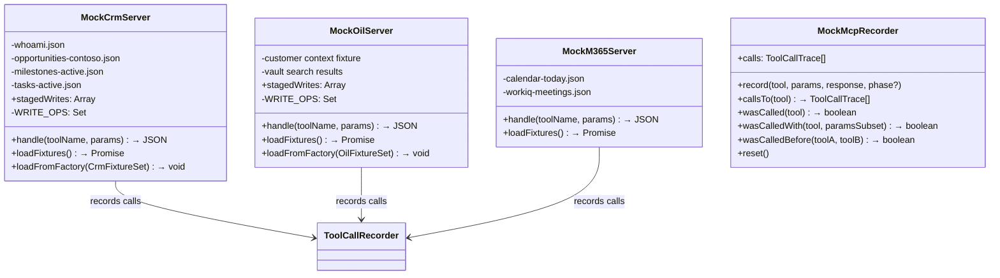

#### How Mock Routing Works

When the LLM (or a hand-crafted test) makes a tool call, the harness routes it by prefix:

| Tool Prefix | Mock Server | Fixture Source |
|---|---|---|
| `msx-crm:*` | `MockCrmServer` | `fixtures/crm-responses/` |
| `oil:*` | `MockOilServer` | Inline vault context |
| `workiq:*`, `calendar:*`, `mail:*` | `MockM365Server` | `fixtures/m365-responses/` |

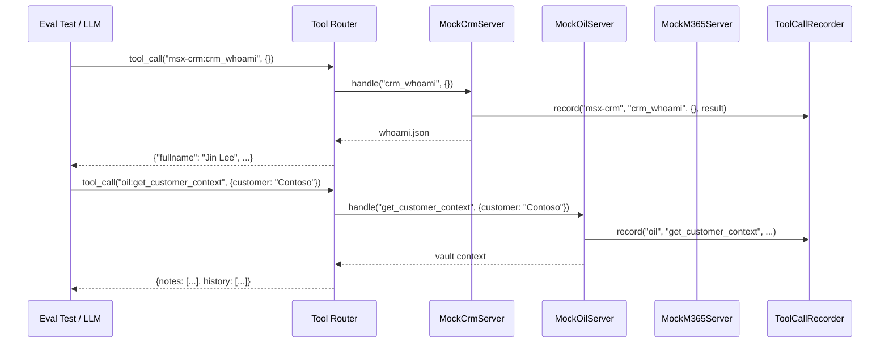

#### Write Safety in Mocks

Both `MockCrmServer` and `MockOilServer` never execute write operations. Instead, they:

1. Accept the write payload
2. Assign a `MOCK-OP-{N}` operation ID
3. Store it in a `stagedWrites` array
4. Return the staging receipt (not a confirmed write)

CRM write operations: `create_milestone`, `update_milestone`, `create_task`, `update_task`, `close_task`, `manage_deal_team`, `manage_milestone_team`, `execute_operation`, `execute_all`.

OIL write operations: `write_note`, `patch_note`, `apply_tags`, `draft_meeting_note`, `promote_findings`.

This mirrors the production `approval-queue.ts` pattern — writes require explicit human confirmation via `execute_operation`.

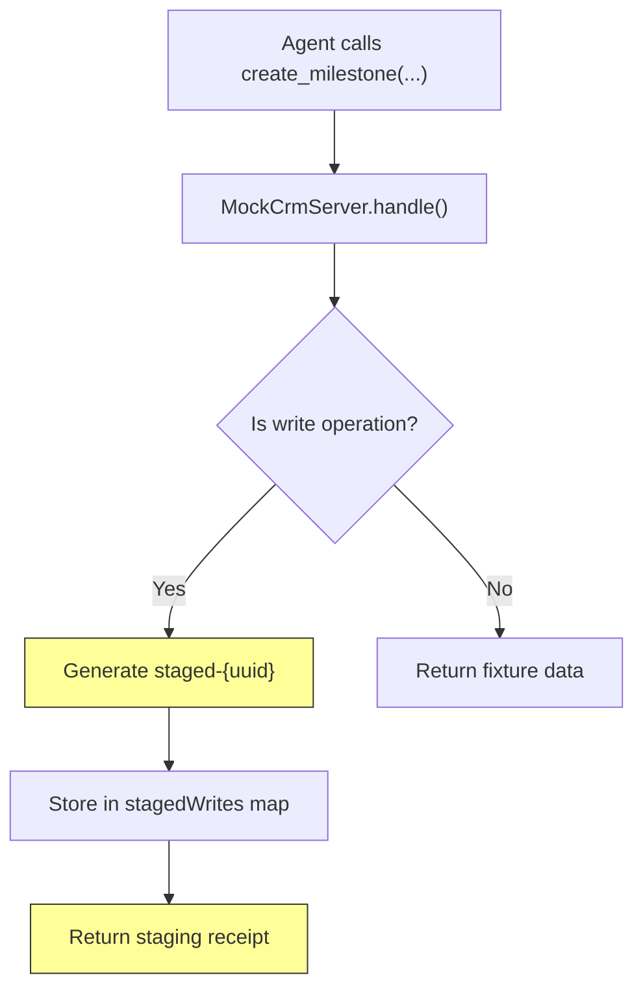

---

## Fixture Data (Mocks)

### CRM Response Fixtures

Located in `evals/fixtures/crm-responses/`:

| File | Content | Used By |
|---|---|---|
| `whoami.json` | User identity — `Jin Lee`, CSA, `jinle@microsoft.com` | Role resolution, AP-010 checks |
| `opportunities-contoso.json` | 2 opps: Azure Migration (Stage 3, $12K/mo) + Security Modernization (Stage 2) | Pipeline queries, morning brief |
| `milestones-active.json` | 3 milestones: Landing Zone (on track), App Mod POC (in progress), Sentinel (**overdue**) | Milestone health, AP-001 checks |
| `tasks-active.json` | 2 tasks: ADS deck (Apr 1), Environment access (Mar 20) | Task hygiene, SE flow |

### M365 Response Fixtures

Located in `evals/fixtures/m365-responses/`:

| File | Content | Used By |
|---|---|---|
| `calendar-today.json` | 2 meetings: Architecture Review (9 AM), Pipeline Review (2 PM) | Morning brief calendar section |
| `workiq-meetings.json` | Recent meeting notes: landing zone topology, firewall rule changes | Cross-medium synthesis |

### Synthetic Fixture Generators

Located in `evals/fixtures/generators/`. These produce controlled fixture data without touching production CRM:

| Factory | Presets | Purpose |
|---|---|---|
| `CrmFixtureFactory` | `pipelineHealth`, `stalePipeline`, `overdueMilestones`, `writeSafety`, `emptyPipeline` | Opportunities, milestones, tasks, identity |
| `OilFixtureFactory` | `standard`, `empty` | Vault context, customer dossiers |
| `M365FixtureFactory` | `standard`, `empty` | Calendar events, WorkIQ results |

Mock servers accept factory output via `loadFromFactory()`, giving each scenario full control over the data shape without disk fixtures.

`schema-guard.ts` validates synthetic fixtures against CRM entity schemas to catch drift: `validateRecord()`, `validateFixtureSet()`, `compareShapes()`.

### YAML Scenario Fixtures

Located in `evals/fixtures/scenarios/` — 5 files, 34+ scenarios:

| File | Scenarios | Purpose |
|---|---|---|
| `skill-routing.yaml` | 15 | Trigger phrases, negative tests, chain activations, role disambiguation |
| `tool-correctness.yaml` | 5 | Factory-bound tool sequences with order/phase/params |
| `anti-patterns.yaml` | 9 | AP-001→AP-010 avoidance scenarios |
| `output-format.yaml` | — | Format compliance schemas |
| `live-scenarios.yaml` | 5 | End-to-end live agent scenarios |

```yaml
# Example from skill-routing.yaml
- id: route-morning-brief
  utterance: "start my day"
  expected_skill: morning-brief
  role: CSA

- id: route-disambiguation
  utterance: "weekly review"
  role: Specialist
  expected_skill: pipeline-hygiene-triage
  not_skill: milestone-health-review

- id: route-chain
  utterance: "prep me for governance"
  expected_skills:
    - mcem-stage-identification
    - milestone-health-review
    - customer-evidence-pack
```

```yaml
# Example from tool-correctness.yaml — with factory binding
- id: milestone-health-overdue
  skill: milestone-health-review
  fixture: overdueMilestones
  context:
    role: CSAM
    customer: Contoso
  expected_calls:
    - tool: msx-crm:get_milestones
      paramsContains: { customerKeyword: "Contoso", statusFilter: "active" }
```

---

## Judges (Scoring Engine)

Four judges analyze tool-call traces and output text. The first three are deterministic; the fourth uses an LLM.

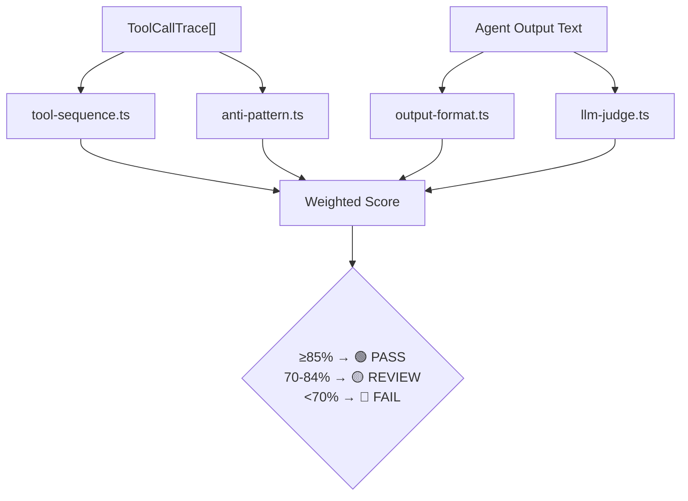

### Scoring Weights

| Dimension | Judge | Weight |
|---|---|---|
| Skill Routing | `routing.eval.ts` (keyword match) | 25% |
| Tool Correctness | `tool-sequence.ts` | 30% |
| Anti-Pattern Avoidance | `anti-pattern.ts` | 20% |
| Output Format | `output-format.ts` | 15% |
| Context Efficiency | `context-budget.eval.ts` | 10% |

### Judge Details

#### `tool-sequence.ts` — Tool Call Correctness

Checks three things against the recorded trace:

1. **Presence**: Were all expected tools called?
2. **Parameters**: Do params match (exact or subset via `params_contain`)?
3. **Ordering**: Are `after` constraints satisfied?

Supports wildcards (`msx-crm:*`) for "any CRM tool was called" assertions.

#### `anti-pattern.ts` — Anti-Pattern Detection

Scans the trace for 10 known bad patterns with **severity-weighted scoring**. Each violation carries a different penalty (AP-005 write bypass = 0.5, AP-001 unscoped query = 0.3, AP-010 role assumption = 0.1, default = 0.2). AP-004 accepts scenario `context.mediums` to skip vault-skip checks on CRM-only scenarios. AP-003 uses param-aware scope grouping for N+1 detection:

```mermaid
flowchart LR
    Trace["ToolCallTrace[]"] --> AP

    subgraph AP["Anti-Pattern Checks"]
        AP1["AP-001: Unscoped get_milestones\n(no customerKeyword/statusFilter/opportunityId)"]
        AP2["AP-002: Wrong entity set\n(msp_milestones instead of msp_engagementmilestones)"]
        AP3["AP-003: N+1 loop\n(3+ sequential calls instead of batch)"]
        AP4["AP-004: Vault skip\n(CRM called but oil:* never called)"]
        AP5["AP-005: Write without staging\n(execute_operation without staged preview)"]
        AP6["AP-006: Guessed property names\n(msp_stage vs msp_activesalesstage)"]
        AP7["AP-007: Disallowed entity set"]
        AP8["AP-008: Vault state as live truth\n(stub — deferred to LLM judge)"]
        AP9["AP-009: Unbounded WorkIQ\n(missing top: or limit)"]
        AP10["AP-010: Role assumed\n(no crm_whoami call)"]
    end

    AP --> Result["violations[] + pass/fail per AP"]
```

#### `output-format.ts` — Output Structure Validation

Validates the final agent response against expected schemas:

- **Required sections**: e.g., morning brief must contain `Pipeline`, `Milestones`, `Meetings` (matches headings or bold text)
- **Required columns**: e.g., milestone table needs `Name`, `Monthly Use`, `Due Date`, `Status`, `Owner` — detection limited to **table header rows only** (the row immediately before a `|---|` separator), preventing false positives from data rows
- **Format type**: table vs. prose detection via `isTableSeparatorRow()` helper
- **Forbidden patterns**: e.g., prose-only when table is required

#### `llm-judge.ts` — Subjective Quality (Phase 2 Only)

Uses Azure OpenAI (RBAC auth via `DefaultAzureCredential`) to score on 5 dimensions (1–5 scale):

| Dimension | What It Measures |
|---|---|
| **Synthesis** | Cross-medium integration (CRM ↔ vault ↔ M365) |
| **Risk Surfacing** | Proactive flags with evidence + role assignment |
| **Role Appropriateness** | Respects MSX role boundaries |
| **Conciseness** | Action-oriented, not verbose |
| **Table Compliance** | Proper format with required columns |

Pass threshold: good output scores ≥ 4 per dimension, overall > 0.7. Poor output must score < 0.5.

Includes **exponential backoff retry logic** (3 retries on 429/timeout: 1s, 2s, 4s delays). Uses structured JSON rubric prompting with `runLlmJudge()` and `formatJudgeReport()` exports.

---

## Phase 1 — Offline Eval Flow

Offline evals run via `npm run eval` (Vitest with `vitest.config.ts`). No LLM or network calls needed.

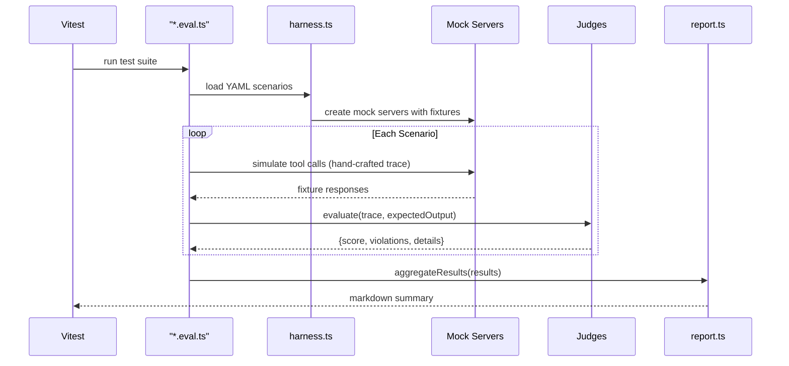

### What Each Offline Test Suite Covers

| Test Suite | File | # Tests | Validates |
|---|---|---|---|
| Skill Routing | `routing/routing.eval.ts` | 12+ | Trigger phrases → correct skill activation, negative/off-topic, chain activation, skill metadata quality |
| Tool Correctness | `tool-correctness/tool-calls.eval.ts` | 6+ | Handwritten + YAML-driven scenarios with factory-bound fixtures |
| Anti-Patterns | `anti-patterns/anti-patterns.eval.ts` | 18+ | Each AP with both positive (catches bad) and negative (passes good) traces |
| Output Format | `output-format/output-format.eval.ts` | 5 | Table columns (header-only), sections, forbidden patterns |
| Context Budget | `context-budget/context-budget.eval.ts` | 4+ | Instruction soft/hard limits (2K/6K), skill limits (3K/8K), chain budget (40%), fixture freshness (30-day hard fail) |

---

## Phase 2 — Live Agent Loop

Live evals run via `npm run eval:live` (Vitest with `vitest.live.config.ts`). Requires Azure OpenAI access.

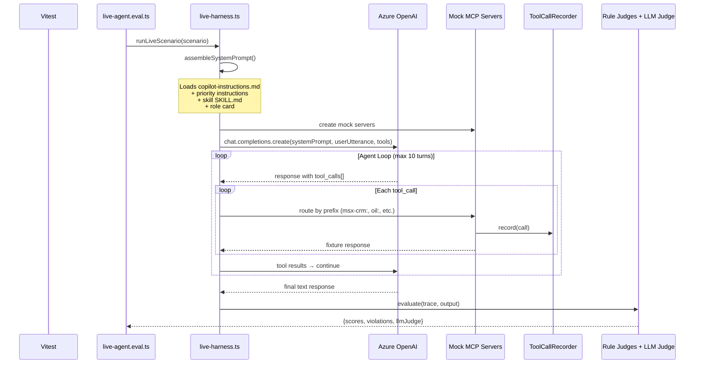

### System Prompt Assembly

`assembleSystemPrompt()` in `live-harness.ts` builds context from real instruction files:

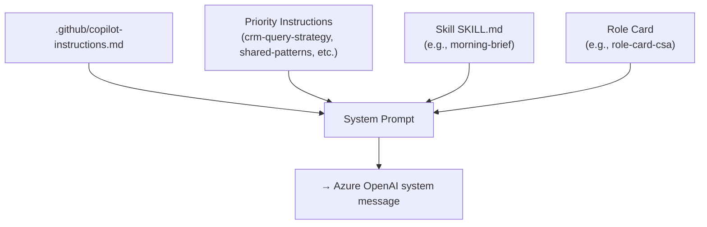

### Mock Tools Definition

`live-harness.ts` defines a `MOCK_TOOLS` array — an OpenAI function-calling schema for **32 tools** that the LLM can call. Tool names use underscore format (`msx_crm__get_milestones`) which the harness maps to prefix format (`msx-crm:get_milestones`) when routing to mock servers.

| Category | Tools |
|---|---|
| **CRM Read** | `crm_whoami`, `crm_auth_status`, `crm_query`, `crm_get_record`, `get_milestones`, `get_my_active_opportunities`, `list_opportunities`, `get_milestone_activities`, `get_milestone_field_options`, `get_task_status_options`, `find_milestones_needing_tasks`, `list_pending_operations` |
| **CRM Write** (staged) | `create_milestone`, `update_milestone`, `create_task`, `update_task`, `close_task`, `manage_deal_team`, `manage_milestone_team`, `execute_operation`, `execute_all` |
| **OIL Read** | `get_vault_context`, `get_customer_context`, `search_vault`, `read_note`, `query_notes`, `query_graph` |
| **OIL Write** (staged) | `write_note`, `patch_note`, `apply_tags`, `draft_meeting_note`, `promote_findings` |
| **M365** | `ask_work_iq`, `ListCalendarView`, `SearchMessages` |

`scripts/sync-mock-tools.js` auto-generates tool definitions from live MCP server schemas to prevent drift.

### Live Scenarios

| # | Scenario | Key Assertions |
|---|---|---|
| 1 | **Morning Brief** | Scoped retrieval, parallel phases, structured output |
| 2 | **Milestone Health** | CSAM governance review, table format, required columns |
| 3 | **Write Safety** | All writes staged (not executed), staging receipt returned |
| 4 | **Vault-First** | `oil:*` called before `msx-crm:*` |
| 5 | **Scoped Query** | No N+1 loops, milestones scoped by keyword/filter |

### Multi-Model Comparison

Set `EVAL_MODELS=gpt-4o-mini,gpt-4o,gpt-4.1-mini` to run all scenarios across multiple models and compare scores side-by-side.

---

## Report Generation & Score Persistence

`report.ts` aggregates individual scenario results into a markdown summary. The `json-persist.ts` Vitest reporter automatically persists structured JSON results after every run.

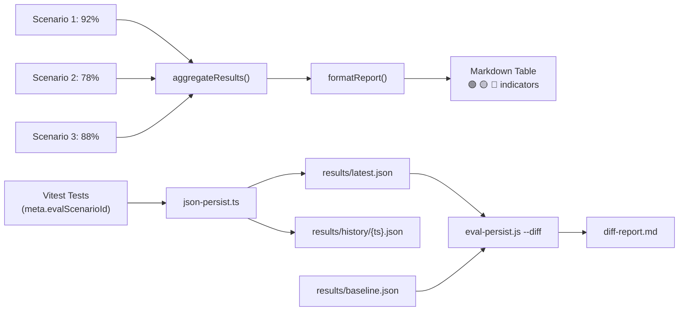

Verdicts:
- **🟢 PASS** — score ≥ 85%
- **🟡 REVIEW** — score 70–84%
- **🔴 FAIL** — score < 70%

### Score Persistence Detail

Tests attach metadata via `attachEvalMeta(task, { scenarioId, dimension, score, pass, violations })`. The custom reporter (`json-persist.ts`) collects all metadata at run end and writes:

- `results/latest.json` — git commit, branch, phase, model, aggregate summary, per-scenario breakdowns
- `results/history/{timestamp}.json` — same data, timestamped for trend analysis
- `results/baseline.json` — committed "known good" reference (via `npm run eval:baseline`)

---

## Configuration

### Vitest Configs

| Config | Command | Includes | Timeout | Reporters |
|---|---|---|---|---|
| `vitest.config.ts` | `npm run eval` | `evals/**/*.eval.ts` (excludes `live/`) | 30s | `verbose` + `json-persist` |
| `vitest.live.config.ts` | `npm run eval:live` | `evals/live/**/*.eval.ts` only | 120s | `verbose` + `json-persist` |

Both configs include the `json-persist.ts` custom reporter, which writes results to `evals/results/` after each run.

### npm Scripts

```bash
# Core eval commands
npm run eval              # Phase 1 — offline, free, fast
npm run eval:watch        # Phase 1 — watch mode
npm run eval:live         # Phase 2 — requires Azure OpenAI
npm run eval:live:watch   # Phase 2 — watch mode
npm run eval:all          # Both phases sequentially

# Regression tracking
npm run eval:baseline     # Run offline + update baseline.json
npm run eval:diff         # Compare latest.json vs baseline.json
npm run eval:history      # Show score trend from history/
npm run eval:trace        # Trace capture/promote/regression CLI

# Fixture management
npm run fixtures:capture          # Capture all servers
npm run fixtures:capture:dry      # Preview without writing
npm run fixtures:capture:redact   # Capture with PII scrubbing
```

### Environment Variables (Phase 2)

| Variable | Required | Default | Purpose |
|---|---|---|---|
| `AZURE_OPENAI_ENDPOINT` | Yes | — | Azure OpenAI resource URL |
| `AZURE_OPENAI_API_VERSION` | No | `2025-03-01-preview` | API version |
| `EVAL_MODEL` | No | `gpt-4o-mini` | Model for agent |
| `EVAL_JUDGE_MODEL` | No | `gpt-4o-mini` | Model for LLM judge |
| `EVAL_MODELS` | No | — | Comma-separated for comparison |
| `EVAL_ITERATIONS` | No | `1` | Runs per scenario |
| `EVAL_TEMPERATURE` | No | `0` | LLM temperature |
| `AZURE_TENANT_ID` | No | — | Tenant for RBAC auth |

---

## Key Design Patterns

### 1. Vault-First Pattern

Judges enforce that `oil:*` calls precede `msx-crm:*` calls, ensuring the agent consults local knowledge before querying CRM. This reduces CRM load and provides richer context.

### 2. Scoped Query Pattern

Any `get_milestones` call must include at least one scoping parameter (`customerKeyword`, `statusFilter`, `opportunityId`, or `tpid`). Unscoped calls trigger AP-001.

### 3. Write Safety via Staging

All CRM writes flow through a staging layer. The mock server (and production `approval-queue.ts`) returns a `staged-{uuid}` receipt instead of executing immediately. The agent must display the staged changes and wait for explicit confirmation via `execute_operation`.

### 4. Parallel Phase Grouping

Skills like `morning-brief` group tool calls into phases:
- **Phase 1** (parallel): `crm_whoami` + `oil:get_vault_context` 
- **Phase 2** (sequential, depends on Phase 1): `get_my_active_opportunities` + `get_milestones` + `ListCalendarView`

### 5. Role-Contextualized Routing

The same utterance routes to different skills based on role:
- "weekly review" + **Specialist** → `pipeline-hygiene-triage`
- "weekly review" + **CSAM** → `milestone-health-review`

---

## Fixture Capture Tool

The capture tool connects to live MCP servers, calls read-only tools, and saves responses as JSON fixtures. This replaces hand-crafted mock data with real snapshots.

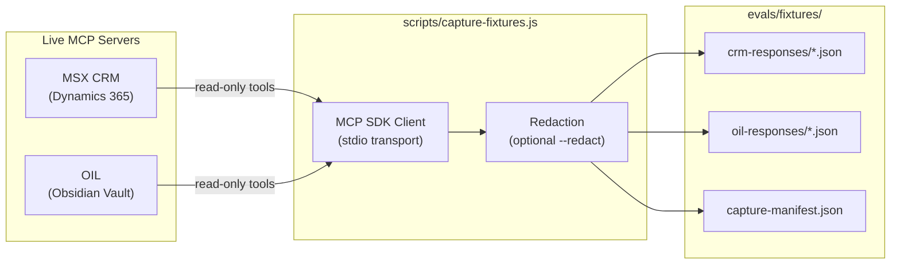

### Commands

```bash
npm run fixtures:capture                        # Capture all servers
npm run fixtures:capture -- --server crm        # CRM only
npm run fixtures:capture -- --server oil        # OIL vault only
npm run fixtures:capture -- --customer Fabrikam # Different customer
npm run fixtures:capture -- --dry-run           # Preview without writing
npm run fixtures:capture -- --redact            # Redact emails & GUIDs
```

### What Gets Captured

| Server | Tool | Output File | Description |
|--------|------|-------------|-------------|
| CRM | `crm_whoami` | `whoami.json` | User identity and role |
| CRM | `get_my_active_opportunities` | `opportunities-mine.json` | Active pipeline |
| CRM | `get_milestones` | `milestones-{customer}.json` | Customer milestones with tasks |
| CRM | `get_milestones` (mine) | `milestones-mine-active.json` | All user's active milestones |
| CRM | `get_milestone_activities` | `tasks-active.json` | Active CRM tasks |
| CRM | `get_milestone_field_options` | `milestone-field-options.json` | Picklist metadata |
| CRM | `get_task_status_options` | `task-status-options.json` | Task status codes |
| OIL | `get_vault_context` | `vault-context.json` | Vault overview |
| OIL | `get_customer_context` | `customer-context-{customer}.json` | Customer dossier |
| OIL | `search_vault` | `search-{customer}.json` | Vault search results |
| OIL | `query_notes` | `notes-{customer}.json` | Customer-tagged notes |

### Safety

- **Read-only**: Only calls read tools — never writes, updates, or deletes
- **Redaction**: `--redact` flag replaces email addresses and zeroes GUID suffixes
- **Gitignored**: `oil-responses/` and `capture-manifest.json` are gitignored (may contain PII)
- **Manifest**: Each capture writes metadata (timestamp, server list, success/failure per tool)

### Fixture Loading Priority

Mock servers load fixtures with a fallback chain:

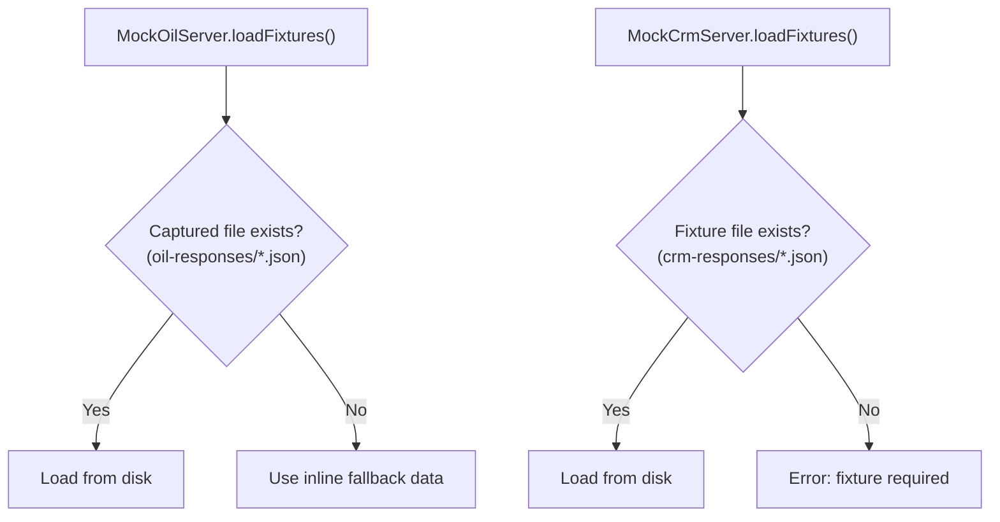

CRM fixtures always load from disk (hand-crafted or captured). OIL fixtures fall back to inline synthetic data when no captured files exist.

---

## Adding a New Eval Scenario

1. **Define the scenario** in the appropriate YAML file under `evals/fixtures/scenarios/`
2. **Add fixture data** via a `CrmFixtureFactory` preset, or add JSON to `evals/fixtures/crm-responses/`
3. **Write the test** in the corresponding `*.eval.ts` file
4. **Attach metadata** via `attachEvalMeta(task, { scenarioId, dimension, score, pass })` for reporter integration
5. **For live scenarios**, add to `evals/fixtures/scenarios/live-scenarios.yaml`
6. **Run**: `npm run eval` (offline) or `npm run eval:live` (live)
7. **Update baseline**: `npm run eval:baseline` after confirming scores are correct

---

## Regression Tracking

### Score Persistence

Every eval run persists results via a custom Vitest reporter (`evals/reporters/json-persist.ts`):

- **`evals/results/latest.json`** (gitignored) — written after every run
- **`evals/results/history/{timestamp}.json`** (gitignored) — timestamped archive
- **`evals/results/baseline.json`** (committed) — the "known good" reference

Each result file contains git commit/branch, phase, model, aggregate summary, and per-scenario dimension breakdowns.

### Baseline Workflow

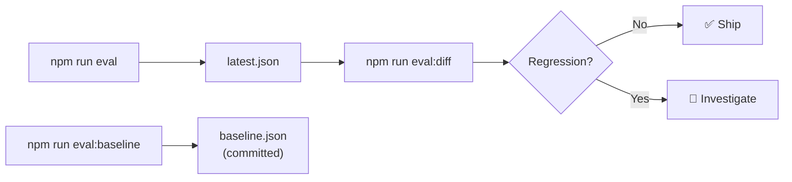

1. `npm run eval:baseline` — runs Phase 1, writes `baseline.json`, committed to repo
2. `npm run eval` — writes `latest.json` (gitignored) + appends to `history/`
3. `npm run eval:diff` — compares latest vs. baseline, outputs `diff-report.md`, exits 1 on regression
4. `npm run eval:history` — prints score trend from history files

---

## Trace System

The trace system captures real agent sessions as replayable golden traces for regression testing.

```
evals/traces/
├── types.ts              # AgentTrace, TraceToolCall, TraceVerification interfaces
├── trace-harness.ts      # Capture, review, promote, regression CLI
├── README.md             # Format documentation
├── golden/               # Committed human-verified traces (.gitkeep)
└── captured/             # Gitignored raw session captures
```

### Workflow

```bash
npm run eval:live -- --capture-trace      # Capture during live eval
npm run eval:trace -- --review <file>     # Review a captured trace
npm run eval:trace -- --promote <file>    # Promote to golden (human-verified)
npm run eval:trace -- --regression        # Regression check vs golden traces
```

Traces include schema version stamps (SHA-256 hash of MOCK_TOOLS) for staleness detection.

---

## Current Results

| Run | Phase | Overall | Level | Scenarios | Passed | Review | Failed |
|-----|-------|--------:|-------|----------:|-------:|-------:|-------:|
| **Baseline** | offline | 92.9% | 🟢 | 7 | 5 | 2 | 0 |
| **Latest** | live | 94.0% | 🟢 | 5 | 4 | 1 | 0 |

### Baseline Scenario Breakdown (2026-03-16)

| Scenario | Score | Level | Notes |
|----------|------:|-------|-------|
| `ap001-unscoped-milestones` | 70% | 🟡 | AP-001 violation detected (expected) |
| `ap004-vault-skip` | 80% | 🟡 | AP-004 violation detected (expected) |
| `milestone-table-format` | 100% | 🟢 | |
| `morning-brief-format` | 100% | 🟢 | |
| `milestone-health-scoped` | 100% | 🟢 | |
| `morning-brief-parallel` | 100% | 🟢 | |
| `yaml-tool-correctness` | 100% | 🟢 | |

### Live Scenario Breakdown

| Scenario | Score | Level |
|----------|------:|-------|
| `live-morning-brief` | 100% | 🟢 |
| `live-milestone-health` | 100% | 🟢 |
| `live-write-safety` | 100% | 🟢 |
| `live-vault-first` | 70% | 🟡 |
| `live-scoped-query` | 100% | 🟢 |

---

## Known Gaps & Future Work

| Item | Status | Notes |
|------|--------|-------|
| AP-008 (vault cache as live truth) | Stub (`return null`) | Deferred to LLM judge |
| Golden traces | Empty directory | Infrastructure complete, no traces promoted yet |
| Routing eval YAML binding | Partial | `routing.eval.ts` uses hardcoded tests, not `skill-routing.yaml` at runtime |
| M365 captured fixtures | Minimal | Only calendar + workiq; no real Teams/Mail captures |
| Schema guard integration tests | Not exercised via eval | `schema-guard.ts` exports exist but no eval verifies them |
| Multi-model comparison baseline | Ready | Only runs when `EVAL_MODELS` has 2+ entries; no comparison data yet |

---

## End-to-End Data Flow

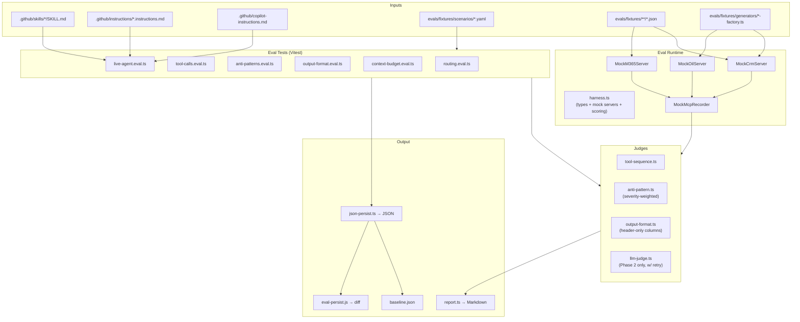
