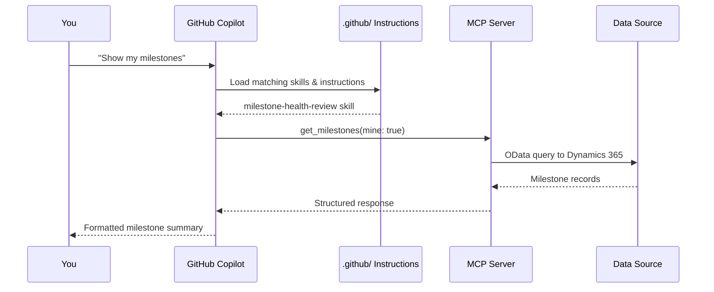
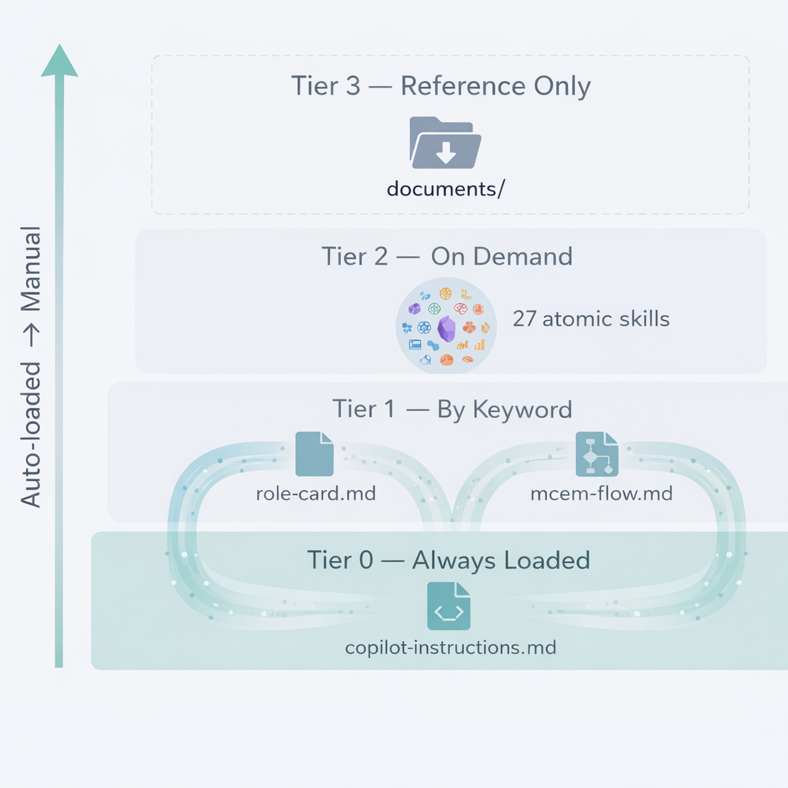

# System Overview


## The Big Picture

```
You (Copilot Chat)
  │
  ├── asks about CRM data  ──→ msx-crm MCP server ──→ MSX Dynamics 365
  ├── asks about M365 data ──→ workiq MCP server   ──→ Teams / Outlook / SharePoint
  ├── asks about notes     ──→ OIL (optional)      ──→ Your Obsidian Vault
  └── asks about analytics ──→ powerbi-remote       ──→ Power BI Semantic Models
```

1. You type a question or action in Copilot chat
2. Copilot reads the role skills and instruction files in `.github/` to understand how to behave
3. It routes your request to the right MCP server (CRM, WorkIQ, Obsidian, or Power BI)
4. For read operations, it returns the results directly
5. For write operations, it shows you what it plans to change and waits for your approval

---

## Data Flow



---

## Project Layout



| Folder | What's Inside | Editable? |
|--------|-------------|-----------|
| `.github/copilot-instructions.md` | Global Copilot behavior — the "system prompt" | **Yes** — your main customization lever |
| `.github/instructions/` | Operational rules loaded by keyword match | **Yes** — add your team's workflow gates |
| `.github/skills/` | 27 atomic domain skills (loaded on demand) | **Yes** — tailor to your operating model |
| `.github/prompts/` | Reusable prompt templates (slash commands) | **Yes** — create workflows you repeat |
| `.vscode/mcp.json` | MCP server definitions | **Yes** — add/remove data sources |
| `mcp/msx/` | MSX CRM MCP server | Optional — works out of the box |
| `mcp/oil/` | Obsidian Intelligence Layer | Optional — enables persistent vault memory |
| `docs/` | Architecture docs | Reference only |

---

## Key Design Principles

### 1. Natural Language First
Everything is accessible through plain English prompts. No query syntax, no CLI flags, no configuration files to learn.

### 2. Domain Expertise Is Data
The 27 skills and instruction files encode MCEM process knowledge, role accountability models, and MSX best practices. This domain expertise is what makes Copilot's responses operationally useful (not just generically correct).

### 3. Human-in-the-Loop
Every write operation requires explicit human approval. The agent suggests; you decide.

### 4. Multi-Medium Synthesis
Real intelligence comes from cross-referencing data sources. CRM says "on track," but emails say "frustrated" — the agent surfaces the mismatch.
