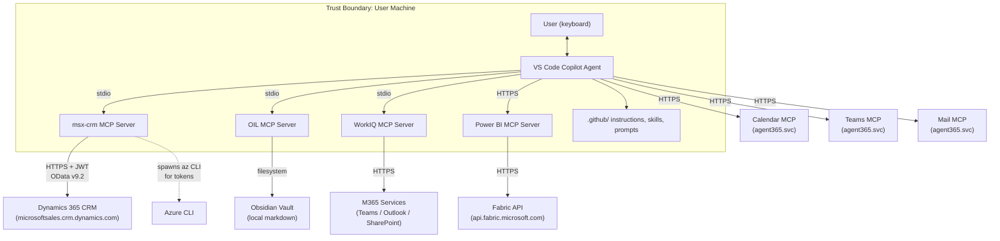

# Threat Model — MCAPS-IQ

> **Date:** 2026-03-15  
> **Methodology:** STRIDE + Data Flow Diagram (Microsoft SDL)  
> **Scope:** All MCP servers, external service integrations, and local data stores in this workspace  
> **Classification:** Microsoft Internal  

---

## 1. System Description

MCAPS-IQ is a VS Code-based AI agent system that orchestrates multiple MCP (Model Context Protocol) servers to give GitHub Copilot read/write access to:

- **Dynamics 365 CRM** (MSX) — opportunities, milestones, tasks, deal teams
- **Microsoft 365** — Teams chats, Outlook email, calendar events, SharePoint files
- **Power BI / Fabric** — DAX queries against semantic models
- **Local Obsidian vault** (OIL) — customer notes, relationship graphs, agent memory

The system runs entirely on the developer's local machine. MCP servers communicate with Copilot via stdio (JSON-RPC) or HTTP. External service calls use Azure AD / Entra ID authentication.

### Actors

| Actor | Description |
|---|---|
| **User** | MCAPS account team member (Specialist, SE, CSA, CSAM) operating VS Code |
| **Copilot Agent** | GitHub Copilot in VS Code, orchestrated by instruction files (.github/) |
| **MCP Servers** | Local Node.js processes (msx-crm, oil, workiq, powerbi-remote) |
| **Dynamics 365** | Microsoft's CRM platform (microsoftsales.crm.dynamics.com) |
| **M365 Services** | Teams, Outlook, Calendar via agent365.svc.cloud.microsoft |
| **Power BI / Fabric** | api.fabric.microsoft.com |
| **Obsidian Vault** | Local filesystem markdown store |

---

## 2. Data Flow Diagram



---

## 3. Trust Boundaries

| # | Boundary | Crosses | Risk Level |
|---|---|---|---|
| **TB-1** | User ↔ VS Code Copilot Agent | User prompts interpreted by LLM | Medium |
| **TB-2** | Copilot Agent ↔ MCP Servers (stdio) | JSON-RPC over local pipes | Low |
| **TB-3** | msx-crm MCP ↔ Dynamics 365 (HTTPS) | Bearer JWT over TLS to external CRM | **High** |
| **TB-4** | WorkIQ MCP ↔ M365 Graph (HTTPS) | Token-authenticated to M365 services | **High** |
| **TB-5** | Copilot ↔ Power BI MCP (HTTPS) | Streamable HTTP to Fabric API | **High** |
| **TB-6** | M365 MCP servers ↔ agent365 (HTTPS) | HTTP to tenant-scoped M365 MCP endpoints | **High** |
| **TB-7** | OIL MCP ↔ Local Filesystem | File I/O within vault directory | Medium |
| **TB-8** | msx-crm ↔ Azure CLI (process spawn) | JSON tokens returned via shell | Medium |
| **TB-9** | Instruction files ↔ Agent behavior | .md files shape LLM tool routing | Medium |

---

## 4. Assets

| Asset | Classification | Location | Compromise Impact |
|---|---|---|---|
| CRM data (opportunities, milestones, tasks, accounts) | HBI — Business-sensitive | Dynamics 365 | Pipeline exposure, competitive intelligence leak |
| M365 communications (email, Teams, calendar) | HBI — Personal + business | Microsoft 365 | Communication exposure, GDPR/privacy violation |
| Power BI semantic models & query results | HBI — Business intelligence | Fabric API | Financial/telemetry data exposure |
| Azure CLI access tokens (JWT) | HBI — Credential | Local memory + process | Full CRM/Azure API impersonation |
| Obsidian vault files | MBI — Work notes | Local filesystem | Customer context, relationship intel leak |
| Agent instruction files (.github/) | LBI — Configuration | Local filesystem | Agent behavior manipulation |
| Audit logs (NDJSON to stderr) | MBI — Operational | Local process stderr | Forensic evidence loss |
| Approval queue state | MBI — Transient | In-memory (msx-crm process) | Unauthorized write execution |

---

## 5. Entry Points

| # | Entry Point | Protocol | Auth | Description |
|---|---|---|---|---|
| **EP-1** | VS Code Copilot Chat | Human input | VS Code session | User prompts that trigger tool calls |
| **EP-2** | MCP stdio transport | JSON-RPC over stdin/stdout | Process-level (same user) | Agent ↔ MCP server communication |
| **EP-3** | MCP HTTP transport | HTTP | Session/header-based | Power BI, Calendar, Teams, Mail MCP endpoints |
| **EP-4** | Instruction/skill files | Filesystem | File-system permissions | .github/ files loaded into agent context |
| **EP-5** | npm packages | Package install | npm registry | Dependencies pulled at install time |
| **EP-6** | Azure CLI spawn | Process execution | User's az login session | Token acquisition |

---

## 6. External Dependencies

| Dependency | Version Constraint | Purpose | Risk |
|---|---|---|---|
| `@modelcontextprotocol/sdk` | ^1.12.1 | MCP server framework | Protocol-level vulnerabilities |
| `openai` | ^6.29.0 | (Available but no direct OpenAI calls observed) | Supply chain |
| `pptxgenjs` | ^4.0.1 | Presentation generation | File format parsing |
| `unzipper` | ^0.12.3 | Archive extraction | Zip slip / path traversal |
| `xml2js` | ^0.6.2 | XML parsing | XXE injection |
| `yaml` (oil) | (transitive) | YAML config parsing | YAML bomb / deserialization |
| `gray-matter` (oil) | (transitive) | Frontmatter parsing | YAML injection via vault files |
| `@xenova/transformers` (oil, optional) | optional peer | Local embeddings | Model integrity |
| Azure CLI | External binary | Token provider | CLI compromise = token theft |
| `@microsoft/workiq` | npx-fetched | M365 retrieval | Supply chain (fetched at runtime) |

---

## 7. STRIDE Analysis

### S — Spoofing

| ID | Threat | Attack Vector | Affected Boundary | Severity | Likelihood |
|---|---|---|---|---|---|
| **S-1** | Impersonation via stolen Azure CLI token | Attacker with local access reads cached az token from `~/.azure/` or intercepts the `az account get-access-token` output | TB-8 | **High** | Medium |
| **S-2** | Prompt injection causes Copilot to act as a different "role" | Malicious content in CRM field values or email bodies loaded into agent context tricks the LLM into ignoring role constraints | TB-1, TB-3 | **High** | Medium |
| **S-3** | Compromised npm package impersonates MCP server | Supply chain attack on `@microsoft/workiq` (fetched via npx at runtime) or other dependencies | EP-5 | **High** | Low |
| **S-4** | Tenant ID spoofing in mcp.json | Attacker modifies `.vscode/mcp.json` to point M365 MCP endpoints to a malicious tenant | TB-6 | Medium | Low |

### T — Tampering

| ID | Threat | Attack Vector | Affected Boundary | Severity | Likelihood |
|---|---|---|---|---|---|
| **T-1** | Instruction file poisoning | Attacker modifies `.github/instructions/` or `.github/skills/` files to alter agent behavior (e.g., skip approval gates, exfiltrate data) | TB-9 | **Critical** | Medium |
| **T-2** | Vault file injection triggers unintended agent actions | Malicious frontmatter or content in Obsidian vault notes cause the agent to make CRM writes or leak data when read by OIL | TB-7 | **High** | Medium |
| **T-3** | CRM response tampering (indirect prompt injection) | Malicious strings injected into CRM field values (e.g., opportunity names containing prompt injection payloads) are loaded into agent context | TB-3 | **High** | Medium |
| **T-4** | Approval queue bypass via race condition | Two concurrent tool calls — one that stages, one that executes — could bypass human review if timing aligns | TB-2 | Medium | Low |
| **T-5** | OData filter injection via crafted parameters | Agent passes unsanitized string into OData `$filter` expression; attacker-controlled CRM field values could alter query semantics | TB-3 | Medium | Low |

### R — Repudiation

| ID | Threat | Attack Vector | Affected Boundary | Severity | Likelihood |
|---|---|---|---|---|---|
| **R-1** | CRM writes without durable audit trail | Audit logs go to stderr (process memory). On process restart, all audit evidence is lost. No persistent audit log file. | All | **High** | High |
| **R-2** | Approval queue state is in-memory only | Staged operations are lost on restart. No record of what was staged, approved, or rejected across sessions. | TB-2 | Medium | High |
| **R-3** | No attribution linkage between Copilot prompt and CRM write | CRM records are updated under the user's Entra ID, but there's no record that the change was AI-initiated vs. manual | TB-3 | Medium | Medium |

### I — Information Disclosure

| ID | Threat | Attack Vector | Affected Boundary | Severity | Likelihood |
|---|---|---|---|---|---|
| **I-1** | Over-broad CRM data in agent context window | Agent fetches large CRM datasets that include sensitive fields (financial, HR-adjacent); these persist in LLM context and conversation history | TB-3 | **High** | High |
| **I-2** | Cross-customer data leakage via unscoped queries | Agent issues `crm_query` without proper customer scoping, pulling data from unrelated accounts into the response | TB-3 | **High** | Medium |
| **I-3** | Token exposure in error messages or logs | Azure CLI error output or stack traces could include partial token content in stderr | TB-8 | Medium | Low |
| **I-4** | Vault data accessible to any local process | Obsidian vault is plain-text markdown on local disk with no encryption or access control beyond OS file permissions | TB-7 | Medium | Medium |
| **I-5** | M365 data (email, Teams, calendar) surfaced to LLM context | WorkIQ and native M365 MCP tools can pull personal communications into Copilot context, which may be logged or cached | TB-4, TB-6 | **High** | High |
| **I-6** | Power BI query results expose business intelligence | DAX queries can pull aggregated financial, consumption, and pipeline data into agent context | TB-5 | **High** | Medium |
| **I-7** | Prompt injection exfiltration via tool chaining | Malicious content in one data source (e.g., email body) instructs the agent to read data from another source (e.g., CRM) and write it to a third (e.g., vault or Teams) | TB-1 | **Critical** | Medium |

### D — Denial of Service

| ID | Threat | Attack Vector | Affected Boundary | Severity | Likelihood |
|---|---|---|---|---|---|
| **D-1** | Context window exhaustion | Unscoped queries return large payloads that consume the entire LLM context window, making the agent unresponsive | TB-3 | Medium | Medium |
| **D-2** | Azure CLI token refresh storm | Rapid successive tool calls each triggering `az account get-access-token` process spawns, exhausting system resources | TB-8 | Low | Low |
| **D-3** | CRM API throttling (429) | High-frequency queries trigger Dynamics 365 rate limits, blocking the entire user's CRM access | TB-3 | Medium | Medium |
| **D-4** | OIL vault indexing on large vaults | Semantic index build (`@xenova/transformers`) on a large vault could consume significant CPU/memory | TB-7 | Low | Low |

### E — Elevation of Privilege

| ID | Threat | Attack Vector | Affected Boundary | Severity | Likelihood |
|---|---|---|---|---|---|
| **E-1** | Entity allowlist bypass via prompt injection | Malicious prompt instructs agent to use `crm_query` with a crafted `entitySet` that evades the string-match allowlist (e.g., URL encoding, case tricks) | TB-3 | **High** | Low |
| **E-2** | Instruction file grants agent capabilities beyond user intent | Modified `.github/copilot-instructions.md` removes write safety gates, allows auto-approve of staged operations | TB-9 | **Critical** | Low |
| **E-3** | OIL path traversal | Crafted `notePath` parameter bypasses `securePath()` validation to read/write files outside vault root | TB-7 | **High** | Low |
| **E-4** | Azure CLI runs with user's full Azure permissions | The `az account get-access-token` call has access to ALL resources the user can access in Azure, not just CRM | TB-8 | Medium | Medium |
| **E-5** | Cross-MCP tool chaining enables unintended multi-service operations | Agent chains read from one service (M365 email) with write to another (CRM milestone update) based on prompt injection | TB-1 | **High** | Medium |

---

## 8. Data Classification

| Data Type | Classification | Flows Through | Stored At |
|---|---|---|---|
| Opportunity pipeline & revenue | HBI | msx-crm → Agent context | Dynamics 365 (source of truth), Agent memory (transient) |
| Customer account details | HBI | msx-crm → Agent context | Dynamics 365 |
| Email content & attachments | HBI / PII | WorkIQ / Mail MCP → Agent context | Exchange Online |
| Teams chat messages | HBI / PII | WorkIQ / Teams MCP → Agent context | Teams service |
| Calendar events & attendees | MBI / PII | Calendar MCP → Agent context | Exchange Online |
| DAX query results (ACR, consumption) | HBI | Power BI MCP → Agent context | Fabric / Power BI |
| JWT access tokens | HBI (credential) | Azure CLI → msx-crm memory | Process memory (cached ~60 min) |
| Vault notes (customer context, insights) | MBI | OIL → Agent context | Local filesystem (plaintext .md) |
| Agent audit logs | MBI | msx-crm stderr | Transient (process lifetime only) |

---

## 9. Existing Mitigations

| Control | Threat(s) Mitigated | Implementation | Gaps |
|---|---|---|---|
| **Entity allowlist** (`ALLOWED_ENTITY_SETS`) | E-1, I-2 | Hardcoded set in `tools.js`; checked before every `crm_query`/`crm_get_record` call | Case-sensitivity and URL-encoding edge cases not fully tested |
| **Staged write approval queue** | T-4, E-2 | `approval-queue.js` — all CRM writes staged with 10-min TTL, human-in-the-loop review | In-memory only; no persistence; no MFA re-prompt |
| **OData string sanitization** | T-5 | `sanitizeODataString()` in `validation.js` — escapes single quotes | Limited to string literals; does not cover all OData injection vectors |
| **GUID validation** | T-5, E-1 | `isValidGuid()` regex in `validation.js` | Only applied to GUID parameters, not all user inputs |
| **Path traversal prevention (OIL, P0-1)** | E-3 | `securePath()` in `vault.ts` now enforces lexical checks plus `realpath` boundary validation for existing paths and nearest-existing-ancestor validation for non-existing paths | Validate behavior on platform-specific symlink restrictions (already covered with tolerant tests) |
| **Pagination integrity + resilience (MSX, P0-2)** | I-1, D-1 | `requestAllPages()` in `crm.js` now fails explicitly on next-link errors, returns partial context, and applies timeout/retry + single 401 refresh for follow-up pages | Partial payload handling must remain stable for downstream callers |
| **Allowed file extensions (OIL)** | E-3, T-2 | `.md`, `.markdown`, `.txt` only | Does not prevent malicious content within allowed file types |
| **Excluded directories (OIL)** | I-4 | `.obsidian`, `.trash`, `node_modules`, `.git` excluded from indexing | Pattern is exclusion-based, not allowlist-based |
| **Audit logging** | R-1 | NDJSON to stderr for every tool invocation via `audit.js` | Volatile (process memory only); no persistent log sink |
| **Token caching with expiry check** | S-1, D-2 | `auth.js` caches tokens, refreshes at 2-min-remaining threshold | Token is in process memory; no encryption at rest |
| **Pagination ceiling (500 records)** | D-1, I-1 | `crm_query` caps at 500 records across all pages | Other tools (e.g., `get_milestones` composite) may still return large payloads |
| **Scoped milestone queries** | I-2, D-1 | `get_milestones` rejects calls without at least one scoping parameter | Scoping relies on correct agent behavior; prompt injection could bypass |
| **Write-gate (OIL)** | T-2 | Tiered gate engine in `gate.ts` — auto-confirmed vs. gated paths with diff preview | Vault writes still go through for auto-confirmed sections |
| **Persistent audit log (RC-1)** | R-1, R-2, R-3 | NDJSON append-only file at `.copilot/logs/audit.ndjson` (configurable via `MCAPS_AUDIT_LOG`). Survives process restarts. | Log rotation not yet implemented |
| **Prompt injection detection (RC-2)** | S-2, T-3, I-7, E-5 | `prompt-guard.js` scans CRM/M365 response data against 10 heuristic patterns. Warnings prepended to reads; `injectionWarning` field on staged writes. | Heuristic-based — may miss novel payloads; no behavioral guardrail |
| **Instruction integrity verification (RC-3)** | T-1, E-2 | `scripts/verify-instructions.js` generates/verifies SHA-256 checksums of all `.github/` instruction and skill files. Integrated into pre-push hook. | Warning-only in pre-push; no cryptographic signing |
| **AI attribution on writes (RH-2)** | R-3 | `[AI-assisted via MCAPS-IQ]` suffix appended to CRM description/comments fields on all write operations | Does not use a dedicated CRM field; relies on text suffix |
| **Cross-service data flow guardrails (RH-3)** | E-5, I-7 | Documented expected vs. restricted cross-service flows in `shared-patterns.instructions.md`. Restricted flows require explicit user confirmation. | Agent-behavioral control only; no enforced technical boundary |
| **WorkIQ version pinning (RH-4)** | S-3 | `@microsoft/workiq@0.4.0` pinned in `mcp.json` instead of unpinned `npx -y` | Must be manually updated when new versions release |

---

## 10. Residual Risks & Recommendations

### Critical Priority — MITIGATED

| # | Risk | Mitigation Implemented (2026-03-14) |
|---|---|---|
| **RC-1** | **No persistent audit log** | `audit.js` now writes append-only NDJSON to `.copilot/logs/audit.ndjson` alongside stderr. Path configurable via `MCAPS_AUDIT_LOG` env var. |
| **RC-2** | **Indirect prompt injection via CRM/M365/email data** | `prompt-guard.js` module with 10 heuristic detection patterns. Log-and-warn on reads; injection warnings surfaced in staged write responses for review before approval. |
| **RC-3** | **Instruction file integrity** | `scripts/verify-instructions.js` (generate/verify SHA-256 checksums) + pre-push hook integration. 59 files baselined. |

### High Priority — MITIGATED

| # | Risk | Mitigation Implemented (2026-03-14) |
|---|---|---|
| **RH-1** | **Token exposure surface** | Documented trusted-endpoint requirements in the [Safety & Write Operations](safety.md) page (disk encryption, screen lock, VPN, no shared accounts). |
| **RH-2** | **No AI-attribution on CRM writes** | `[AI-assisted via MCAPS-IQ]` suffix appended to description/comments fields in all CRM write payloads. |
| **RH-3** | **Cross-service data flow via tool chaining** | Documented expected and restricted cross-service flows in `shared-patterns.instructions.md` with guidance for user confirmation on restricted flows. |
| **RH-4** | **WorkIQ fetched via npx at runtime** | Pinned to `@microsoft/workiq@0.4.0` in `.vscode/mcp.json`. |
| **RH-5** | **`unzipper` and `xml2js` have known attack vectors** | `npm audit fix` applied (resolved hono prototype pollution). Safe xml2js parsing options (`explicitRoot: true`, no DTD) recommended in skill documentation. |

### Medium Priority

| # | Risk | Recommendation | Effort |
|---|---|---|---|
| **RM-1** | **Vault data at rest is unencrypted** — Customer notes, relationship graphs, and CRM identifier mappings stored as plaintext markdown. | Document that vault hosts MBI data and endpoint disk encryption (FileVault/BitLocker) is required. Consider encrypting sensitive frontmatter fields. | Small |
| **RM-2** | **No session isolation between customers** — Agent context can contain data from multiple customers simultaneously. | Skills already encourage customer-scoped queries. Add explicit context-clearing guidance between customer-switching operations. | Small |
| **RM-3** | **Hardcoded tenant ID in mcp.json** — `72f988bf-86f1-41af-91ab-2d7cd011db47` is embedded in multiple places. | Move tenant ID to environment variable or `.env` file. Validate at startup that the authenticated user belongs to the configured tenant. | Small |
| **RM-4** | **OIL write gate auto-confirms certain sections** — `autoConfirmedSections` and `autoConfirmedOperations` in config allow some writes without human review. | Review the auto-confirmed list against data sensitivity. Consider logging auto-confirmed writes separately for audit. | Small |

---

## 11. Service Boundary Summary (Security Review Trigger)

Per the policy: *"Apps must complete a security review if they leverage services outside Microsoft 365 tenant boundaries."*

| Service | Outside M365 Tenant? | Data Accessible | Review Required? |
|---|---|---|---|
| **Dynamics 365 CRM** (microsoftsales.crm.dynamics.com) | **Yes** — Dataverse is outside M365 tenant boundary | Opportunities, milestones, tasks, accounts, deal teams, pipeline data | **Yes** |
| **Power BI / Fabric** (api.fabric.microsoft.com) | **Yes** — Fabric is a separate service boundary | Semantic models, DAX query results, consumption/ACR telemetry | **Yes** |
| **M365 MCP (agent365.svc)** | Tenant-scoped but via external MCP proxy | Teams, Mail, Calendar data | **Yes** — the agent365 proxy is an external service mediating M365 access |
| **WorkIQ** (@microsoft/workiq) | **Yes** — accesses M365 Graph via external npm package | Teams, Outlook, SharePoint, OneDrive content | **Yes** |
| **Azure CLI** | N/A (local binary) | Tokens for all Azure resources the user can access | N/A (but token scope is a risk) |
| **Obsidian Vault (OIL)** | No — local filesystem only | Customer notes, relationship context | No |

**Conclusion:** This project **requires a security review** — it accesses Dynamics 365, Power BI/Fabric, and M365 services through MCP servers, all of which cross the M365 tenant boundary. The review should be scoped to the full data access capability of the system (not just current use cases), per the stated policy.

---

## 12. Security P0 Remediation Record (Integrated)

This section consolidates the former P0 remediation spec and test plan into the threat model to keep implementation intent, acceptance criteria, and verification evidence in one place.

### Scope

1. OIL vault path escape via symlink traversal (P0-1)
2. MSX CRM pagination integrity and resilience gaps (P0-2)

### Non-goals

- No redesign of write approval gates
- No tool-surface contract renaming
- No policy changes outside symlink boundary enforcement and pagination error signaling

### Functional Requirements

| ID | Requirement | Status |
|---|---|---|
| FR-1 | `securePath` must be symlink-safe via real-path vault boundary checks | Complete |
| FR-2 | Valid in-vault paths remain backward compatible | Complete |
| FR-3 | `requestAllPages` must not silently return `ok: true` on pagination failure | Complete |
| FR-4 | Follow-up page requests must use timeout/retry and one-time 401 refresh | Complete |

### Contract Expectations

- OIL `securePath(vaultPath, notePath): string` remains synchronous and throws on boundary violations.
- MSX `requestAllPages` success shape remains unchanged when pagination completes.
- On pagination failure: `ok: false`, non-200 status where available, explicit pagination-failure message, and partial context (`partialCount`, `partial.value`).

### Security Acceptance Criteria

1. Symlink file and symlink directory escape attempts are rejected by `securePath`.
2. Read paths cannot escape vault via existing symlink targets.
3. Pagination errors cannot be interpreted as complete-success reads.

### Test Strategy and Evaluation Matrix

Baseline intent (historical): add regression tests that fail pre-fix, then pass post-fix.

| Test ID | Condition | Baseline Expectation | Post-fix Expectation | Result on Current Branch |
|---|---|---|---|---|
| OIL-SEC-01 | Symlink file escape | Fail | Pass | Pass |
| OIL-SEC-02 | Symlink dir escape | Fail | Pass | Pass |
| MSX-PAG-01 | nextLink failure handling | Fail | Pass | Pass |
| MSX-PAG-02 | partial context on failure | Fail/Not enforced | Pass | Pass |

### Verification Commands

```bash
cd mcp/oil && npx vitest run src/__tests__/securepath-traversal.test.ts
cd ../msx && npx vitest run src/__tests__/crm.test.js
cd ../oil && npx vitest run
cd ../msx && npx vitest run
```

### Verification Outcome (2026-03-15)

- OIL targeted regression suite: passing
- MSX targeted regression suite: passing
- OIL full suite: passing
- MSX full suite: passing

### Rollout Record

1. Regression tests added for symlink traversal and pagination failure semantics
2. Remediation implemented in OIL `securePath` and MSX `requestAllPages`
3. Targeted and full suite verification completed
4. Evidence captured in this threat model as canonical security record

---

## Appendix A: Tool Inventory by Server

### msx-crm (12 read tools, 3 viz tools, 7 write tools, 5 approval tools)

**Reads:** `crm_whoami`, `crm_auth_status`, `crm_query`, `crm_get_record`, `list_opportunities`, `get_my_active_opportunities`, `get_milestones`, `get_milestone_activities`, `find_milestones_needing_tasks`, `list_accounts_by_tpid`, `get_milestone_field_options`, `get_task_status_options`

**Writes (staged):** `create_milestone`, `create_task`, `update_task`, `close_task`, `update_milestone`, `manage_deal_team`, `manage_milestone_team`

**Approval:** `list_pending_operations`, `execute_operation`, `execute_all`, `cancel_operation`, `cancel_all`

### OIL (22 tools — read/write gated)

Customer context reads, vault search (fuzzy/semantic/graph), note creation/patching, connect hook capture, agent action logging, CRM prefetch, people-to-customer resolution, tag management, graph queries, drift reports, vault health checks.

### WorkIQ (1 composite tool)

`ask_work_iq` — searches Teams, Outlook, SharePoint, OneDrive, meeting transcripts.

### Power BI Remote (HTTP MCP)

`ExecuteQuery`, `GenerateQuery`, `GetSemanticModelSchema`, `GetReportMetadata`, `DiscoverArtifacts`.

### M365 Native MCP (Calendar, Teams, Mail — HTTP)

Calendar: `ListCalendarView`, `ListEvents`, `CreateEvent`, `UpdateEvent`, `DeleteEventById`, `AcceptEvent`, `DeclineEvent`, `TentativelyAcceptEvent`, `ForwardEvent`, `CancelEvent`, `FindMeetingTimes`, `GetRooms`, `GetUserDateAndTimeZoneSettings`

Teams: `ListTeams`, `ListChannels`, `ListChats`, `ListChatMessages`, `ListChannelMessages`, `PostMessage`, `PostChannelMessage`, `CreateChat`, `CreateChannel`, `CreatePrivateChannel`, `SearchTeamsMessages`, etc.

Mail: `SearchMessages`, `GetMessage`, `SendEmailWithAttachments`, `ReplyToMessage`, `ForwardMessage`, `CreateDraftMessage`, `SendDraftMessage`, `DeleteMessage`, etc.

---

## Appendix B: Recommended SDL Actions

- [ ] Submit for DSR security review with this threat model attached
- [x] Run `npm audit` across all workspaces (`mcp/msx/`, `mcp/oil/`, root) — **Done 2026-03-14**: fixed hono prototype pollution in both MCP servers
- [x] Pin `@microsoft/workiq` version in mcp.json — **Done 2026-03-14**: pinned to `@microsoft/workiq@0.4.0` (RH-4)
- [x] Implement persistent audit log (file-based NDJSON) — **Done 2026-03-14**: `audit.js` now writes to `.copilot/logs/audit.ndjson` (configurable via `MCAPS_AUDIT_LOG` env var) (RC-1)
- [x] Add AI-attribution metadata to CRM write payloads — **Done 2026-03-14**: `[AI-assisted via MCAPS-IQ]` suffix on description/comments fields (RH-2)
- [x] Document required endpoint security posture (disk encryption, screen lock, VPN) — **Done 2026-03-14**: added to `docs/write-safety.md` (RH-1)
- [x] Test entity allowlist against case-variation and encoding bypass attempts — **Done 2026-03-14**: 23 tests covering case-variation, URL-encoding, Unicode homoglyphs, structural/path tricks, whitespace, and null inputs. All bypass attempts correctly rejected by case-sensitive `Set.has()` check.
- [x] Test and harden `securePath()` against symlink traversal — **Done 2026-03-15**: real-path boundary enforcement implemented in `vault.ts`; targeted symlink traversal regressions pass.
- [x] Add and verify pagination failure semantics in `requestAllPages()` — **Done 2026-03-15**: next-link failures now return `ok: false` with partial context and retry/timeout consistency; targeted regressions pass.
- [x] Review `xml2js` configuration for DTD/XXE protections — **Done 2026-03-14**: verified `xml2js@0.6.2` usage; safe parsing options (`explicitRoot: true`, no DTD) recommended in skill docs (RH-5)
- [x] Add prompt injection warning to user docs and instruction files — **Done 2026-03-14**: `prompt-guard.js` module with detection heuristics + warnings on reads and writes (RC-2)
- [x] Add instruction file integrity verification — **Done 2026-03-14**: `scripts/verify-instructions.js` + pre-push hook integration (RC-3)
- [x] Document cross-service data flow guardrails — **Done 2026-03-14**: added to `shared-patterns.instructions.md` (RH-3)