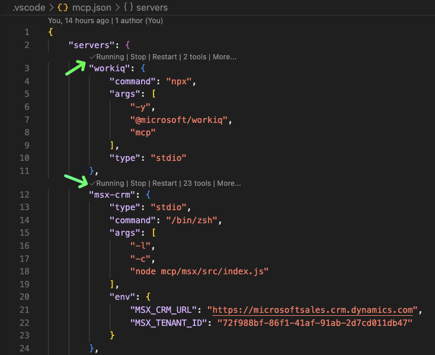

# Your First Chat

<div class="step-indicator" markdown>
<span class="step done">1. Prerequisites ✓</span>
<span class="step done">2. Install ✓</span>
<span class="step active">3. First Chat</span>
<span class="step">4. Choose Role</span>
</div>

This is the moment everything comes together. You'll start the MCP servers and ask Copilot your first question.

---

## Start the MCP Servers

1. In VS Code, open the file `.vscode/mcp.json`
2. You'll see **"Start"** buttons above each server definition
3. Click **Start** on **`msx-crm`** (required)
4. Optionally click **Start** on **`workiq`** (for M365 searches)



!!! tip "What are MCP servers?"
    MCP (Model Context Protocol) servers are bridges between Copilot and your data. The `msx-crm` server connects to your MSX Dynamics 365 CRM. The `workiq` server connects to your Microsoft 365 data (Teams, Outlook, SharePoint).

!!! info "Server status"
    Once started, you'll see **"Running"** indicators next to each server with the number of tools available. `msx-crm` provides ~23 tools, `workiq` provides 2 tools.

---

## Open Copilot Chat

Press ++cmd+shift+i++ (or click the Copilot icon in the sidebar).

The Copilot chat panel opens. This is your command center.

---

## Ask Your First Question

Type this into the Copilot chat window:

```
Who am I in MSX?
```

??? example "What you'll see"
    Copilot will:
    
    1. Call the `crm_whoami` tool to check your identity
    2. Return your name, alias, role, and organizational unit
    3. Confirm your authentication is working
    
    Example response:
    ```
    You are Jane Doe (janedoe@microsoft.com)
    Role: Cloud Solution Architect
    Business Unit: US Federal
    ```

!!! success "If you got a response — congratulations! :tada:"
    You've successfully connected Copilot to MSX CRM. Everything is working.

!!! failure "Got an error?"
    | Error | Fix |
    |-------|-----|
    | "Not authenticated" | Run `az login` again in your terminal |
    | "Server not running" | Click **Start** on `msx-crm` in `.vscode/mcp.json` |
    | "Connection refused" | Check VPN is connected |
    | "Token expired" | Run `az login` to refresh |
    | No response at all | Make sure the Copilot extension is active (check bottom status bar) |

---

## Try Two More Prompts

Now that you're connected, try these:

### See your pipeline

```
Show me my active opportunities.
```

This calls `list_opportunities` and returns your current deals with stages, values, and health indicators.

### Run a quick review

```
It's Monday — run my weekly pipeline review.
```

This triggers a multi-skill chain that:

- Sweeps your pipeline for hygiene issues
- Flags stale opportunities and missing fields
- Produces a prioritized action list

---

## What Just Happened?

Behind the scenes, Copilot:

1. **Read the instruction files** in `.github/` to understand MSX domain rules
2. **Matched your prompt** to the relevant skills (e.g., `pipeline-hygiene-triage`)
3. **Called MCP tools** (`crm_whoami`, `list_opportunities`, `get_milestones`)
4. **Synthesized results** into a human-readable response

You didn't write any code, configure any queries, or specify any tool names. You just described what you needed.

!!! quote "The magic moment"
    *"Wait — it just... knows which CRM queries to run?"*
    
    Yes. The skill files teach Copilot which tools to call and in what order. You focus on the business question; Copilot handles the tooling.

---

## Next: Tell Copilot Your Role

Copilot works even better when it knows your MCAPS role. The next step takes 30 seconds:

[:octicons-arrow-right-16: Choose Your Role](choose-role.md){ .md-button .md-button--primary }
