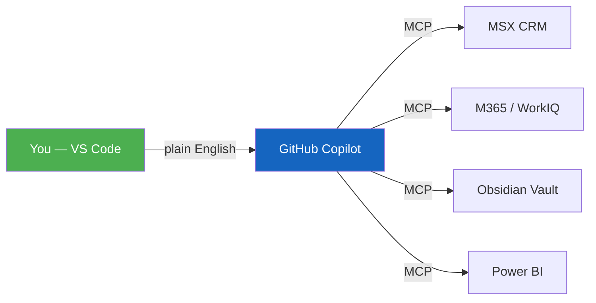

# Getting Started

!!! success "5 minutes to your first result"
    You'll go from a fresh clone to asking Copilot about your MSX pipeline in about 5 minutes. No coding, no configuration files to hand-edit.

## The Setup Path

1. Prerequisites
2. Install
3. First Chat
4. Choose Role

| Step | What You'll Do | Time |
|------|---------------|------|
| [**Prerequisites**](prerequisites.md) | Verify you have VS Code, Node.js, Azure CLI, and VPN | 2 min |
| [**Installation**](installation.md) | Clone the repo, install dependencies, sign in to Azure | 3 min |
| [**Your First Chat**](first-chat.md) | Open Copilot, start the MCP servers, and ask your first question | 1 min |
| [**Choose Your Role**](choose-role.md) | Tell Copilot who you are so it tailors its behavior | 30 sec |

---

## Quick Visual: What You're Building

You're connecting Copilot to your enterprise data sources via MCP servers. Once connected, you just talk to it.

---

## Something Not Working?

Jump to [Troubleshooting Setup](troubleshooting.md) — it covers every common issue with step-by-step fixes.

[:octicons-arrow-right-16: Start with Prerequisites](prerequisites.md){ .md-button .md-button--primary }
