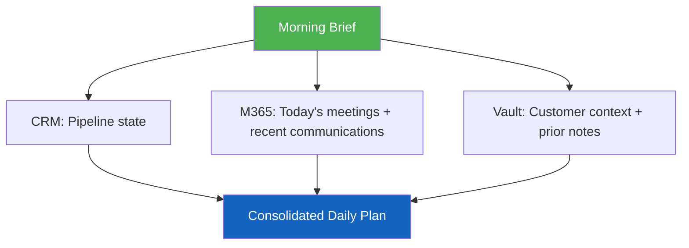

# Day 5: The Lightbulb Moment :material-lightbulb-on:

<div class="step-indicator" markdown>
<span class="step done">Day 1 ✓</span>
<span class="step done">Day 2 ✓</span>
<span class="step done">Day 3 ✓</span>
<span class="step active">Day 5</span>
</div>

**Goal:** Experience the full power of agentic AI — cross-medium synthesis, strategic intelligence, and workflows that would take hours done manually.

**Time:** ~20 minutes

---

!!! abstract "The shift"
    On Days 1–3, you learned Copilot can _read your data_ and _chain skills_. Today, you'll see something different: Copilot acting as a **strategic partner** that connects rooms of information that normally stay separated.
    
    This is the difference between a chatbot and an agent.

---

## Scenario 1: The Morning Brief

Start your day with this:

```
Good morning. Run my morning brief.
```

**What happens:**

Copilot launches **parallel retrieval** across three data sources simultaneously:



**What you get:**

- **Pipeline snapshot** — what moved, what's stuck, what's at risk
- **Today's meetings** — with pre-loaded context from CRM + vault for each one
- **Overdue actions** — tasks, milestones, and follow-ups that need attention
- **Top 3 priorities** — ranked by impact and urgency

!!! success "The lightbulb"
    This single prompt replaces 20–30 minutes of manual morning prep: opening MSX, checking your calendar, re-reading email threads, and figuring out priorities. The agent did it in seconds because it has access to _all the rooms_ simultaneously.

---

## Scenario 2: Cross-Medium Intelligence

This prompt connects CRM data with real human communication:

```
I have a QBR with Northwind next week. Prepare an evidence pack with 
CRM status and recent customer communications from the last 30 days. 
Flag anything where the CRM record and the actual communications tell 
different stories.
```

**What happens:**

1. CRM data shows milestones as "on track"
2. WorkIQ finds an email thread where the customer expressed frustration about delays
3. Copilot **flags the mismatch** — the CRM says green, but the communication says yellow

!!! warning "Why this matters"
    CRM records are lagging indicators. Communication is a leading indicator. An agent that can cross-reference both and flag divergence gives you relationship intelligence that no dashboard provides.

---

## Scenario 3: Account Landscape Discovery

```
What else is happening across the Contoso account? Show me all pipeline — 
not just my deals, but adjacent opportunities where I might be able to swarm 
or where there's EDE coverage I should know about.
```

**What happens:**

- Copilot queries CRM for **all** opportunities on the account, not just yours
- Identifies how many roles are active, what stages they're in, and where gaps exist
- Surfaces **swarming opportunities** — adjacent pipeline in other solution areas
- Flags EDE/package coverage gaps

!!! quote "The 'rooms of the house' insight"
    *"I had no idea there was a Data & AI deal on the same account. The CSA for that deal is someone I work with. We should coordinate."*
    
    This is what cross-role visibility looks like. The data was always there — in separate CRM views, different meetings, different Teams channels. The agent connects the rooms.

---

## Scenario 4: Strategic Deal Triage with Role Orchestration

```
I think the Fabrikam deal is more complex than it looks. Do a full triage: 
what stage are we really in, check all exit criteria, surface every risk you 
can find, and tell me which team should own the next action. Include evidence 
from both CRM and M365.
```

**What runs (5+ skills across 2+ mediums):**

1. `mcem-stage-identification` — analyzes CRM state vs. actual activity
2. `exit-criteria-validation` — checks each formal criterion against evidence
3. `risk-surfacing` — synthesizes CRM, M365, and behavioral signals
4. `role-orchestration` — maps who should own what based on current state
5. Potentially `customer-evidence-pack` — pulls supporting communication evidence

**What you get:**

A comprehensive triage report that would take a senior deal manager 1–2 hours to assemble manually. With sources cited, risks ranked, and next actions assigned to specific roles.

---

## Scenario 5: The Expansion Signal

During a regular review, ask:

```
Review adoption health for Fabrikam, check if we're realizing value on 
committed milestones, and flag any expansion signals that should go to 
the Specialist as a new opportunity.
```

**What runs:**

1. `adoption-excellence-review` — checks MAU, DAU, license utilization vs. targets
2. `value-realization-pack` — validates measurable outcomes exist for completed work
3. `expansion-signal-routing` — captures growth signals and routes to Specialist

!!! success "Land and expand, automated"
    The traditional CSAM workflow: notice expansion opportunity in a conversation → remember to tell the Specialist → Specialist eventually creates a new opportunity → weeks pass.
    
    The agent workflow: detects the signal → documents it → proposes the new opportunity → routes it to the right role. Same meeting, same prompt.

---

## Scenario 6: The Authority Tie-Break

Real-world complexity:

```
The CSA and I are giving conflicting direction on the Vocera milestone. 
I think we should commit; they think the architecture isn't ready. 
Who owns this decision?
```

**What runs:**

- `execution-authority-clarification` — maps each role's decision domain
- References the MCEM process model for accountability boundaries
- Assigns a **single decision-owner** for the specific disputed domain

!!! info "No more email threads about who decides"
    This is one of the most common productivity drains in account teams. The agent knows the MCEM accountability model and can break the tie immediately.

---

## What Just Happened?

You went from asking "who am I?" on Day 1 to running strategic cross-medium intelligence that connects:

| Medium | What It Provides |
|--------|-----------------|
| **CRM** | Pipeline state, milestone health, deal metadata |
| **M365** | Communication evidence, meeting decisions, stakeholder signals |
| **Vault** | Persistent memory, customer context, prior engagement history |
| **Power BI** | Consumption telemetry, ACR targets, incentive baselines |

All queryable in natural language. All synthesized into unified outputs. All with the domain expertise of the MCEM process model baked in.

---

## The Lightbulb Framework

!!! abstract "What makes this different from a chatbot"
    
    | Chatbot | Agent |
    |---------|-------|
    | Answers one question at a time | Orchestrates multi-step workflows |
    | Uses one data source | Cross-references multiple mediums |
    | Requires you to know what to ask | Proactively surfaces what you're missing |
    | Generic responses | Role-tailored, context-aware output |
    | Forgets context between sessions | Persistent memory via vault |
    | You orchestrate the workflow | The agent orchestrates — you approve |

---

## Where to Go From Here

You've completed the guided experience. Here's how to keep going:

<div class="grid cards" markdown>

-   :material-calendar-check:{ .lg .middle } __Make It Daily__

    ---

    Use `/daily` every morning. It becomes a habit in 3 days.

    [:octicons-arrow-right-16: Slash Commands](../prompts/slash-commands.md)

-   :material-puzzle:{ .lg .middle } __Customize for Your Team__

    ---

    Fork the instruction files and add your team's workflow rules.

    [:octicons-arrow-right-16: Customization Guide](../customization/index.md)

-   :material-notebook:{ .lg .middle } __Add Persistent Memory__

    ---

    Set up Obsidian vault integration for cross-session context.

    [:octicons-arrow-right-16: Obsidian Setup](../integrations/obsidian.md)

-   :material-chart-bar:{ .lg .middle } __Connect Analytics__

    ---

    Add Power BI for consumption telemetry and ACR dashboards.

    [:octicons-arrow-right-16: Power BI Setup](../integrations/powerbi.md)

</div>

---

!!! tip "Share the experience"
    The best way to spread adoption is to show someone their own data through this lens. Sit with a teammate, run the morning brief on _their_ pipeline, and watch the lightbulb go on.
