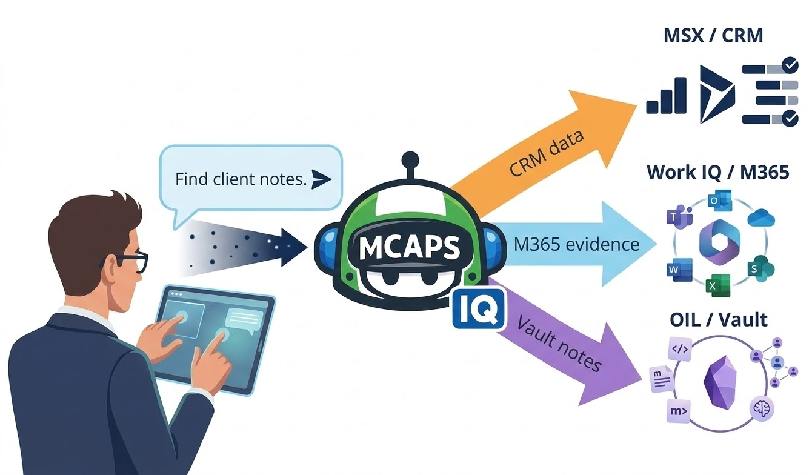

<div class="hero" markdown>

{ width="180" }

# MCAPS IQ

**Talk to Copilot in plain English to manage your MSX pipeline.**{ .tagline }

[:octicons-rocket-16: Get Started in 5 Minutes](getting-started/index.md){ .md-button .md-button--primary }
[:octicons-book-16: Guided Experience](guided/index.md){ .md-button }

</div>

---

## What Is This?

MCAPS IQ connects **GitHub Copilot** (in VS Code) to your **MSX CRM** and **Microsoft 365** data. Instead of clicking through MSX screens, you describe what you need in the Copilot chat window and the tools handle it.

!!! tip "No coding required"
    The primary interface is the Copilot chat window — you type in plain English and Copilot does the rest. The code in this repo powers the tools behind the scenes.

<div class="grid cards" markdown>

-   :material-database-search:{ .lg .middle } __Read Your Pipeline__

    ---

    Look up opportunities, milestones, tasks, and ownership — all from the chat window.

-   :material-pencil-box-outline:{ .lg .middle } __Update CRM Records__

    ---

    Create tasks, close milestones, update statuses. Always asks before writing.

-   :material-email-search:{ .lg .middle } __Search M365__

    ---

    Find Teams chats, meeting transcripts, emails, and documents with natural language.

-   :material-account-cog:{ .lg .middle } __Role-Aware Guidance__

    ---

    Knows your MCAPS role (Specialist, SE, CSA, CSAM) and tailors guidance accordingly.

</div>

---

## How It Works

```
You (Copilot Chat)
  │
  ├── asks about CRM data  ──→ msx-crm MCP server ──→ MSX Dynamics 365
  ├── asks about M365 data ──→ workiq MCP server   ──→ Teams / Outlook / SharePoint
  └── asks about notes     ──→ OIL (optional)      ──→ Your Obsidian Vault
```

1. You type a question or action in Copilot chat
2. Copilot reads the role skills and instruction files to understand how to behave
3. It routes your request to the right MCP server
4. For reads, it returns results directly
5. For writes, it shows a diff and waits for your approval



---

## Your First 3 Prompts

Once you're set up, open Copilot chat (++cmd+shift+i++) and try:

| Prompt | What happens |
|--------|-------------|
| `Who am I in MSX?` | Identifies your CRM role and account team |
| `Show me my active opportunities.` | Lists your pipeline with stage and health |
| `It's Monday — run my weekly pipeline review.` | Hygiene sweep + prioritized action list |

[:octicons-arrow-right-16: See all prompts by role](prompts/by-role.md){ .md-button }

---

## Pick Your Role

<div class="grid cards" markdown>

-   :material-chart-line:{ .lg .middle } __Specialist__

    ---

    Pipeline creation, deal qualification, Stage 2–3 progression

    [:octicons-arrow-right-16: Specialist prompts](prompts/by-role.md#specialist)

-   :material-wrench:{ .lg .middle } __Solution Engineer__

    ---

    Technical proofs, task hygiene, architecture reviews

    [:octicons-arrow-right-16: SE prompts](prompts/by-role.md#solution-engineer)

-   :material-vector-polygon:{ .lg .middle } __Cloud Solution Architect__

    ---

    Execution readiness, architecture handoff, delivery ownership

    [:octicons-arrow-right-16: CSA prompts](prompts/by-role.md#cloud-solution-architect)

-   :material-shield-check:{ .lg .middle } __CSAM__

    ---

    Milestone health, adoption tracking, commit gates, value realization

    [:octicons-arrow-right-16: CSAM prompts](prompts/by-role.md#csam)

</div>

---

## Safety First

!!! warning "Agentic AI can make mistakes"
    This toolkit uses AI models that may produce incorrect, incomplete, or misleading outputs. **You are responsible for reviewing and validating every action before it takes effect.**

All CRM write operations use a **Stage → Review → Execute** pattern:

1. **Stage** — your change is validated locally. Nothing is written to CRM yet.
2. **Review** — Copilot shows a before/after diff and asks for approval.
3. **Execute** — only after you approve does the change go through.

[:octicons-shield-check-16: Learn about write safety](architecture/safety.md){ .md-button }

---

!!! note "This is a showcase of GitHub Copilot's extensibility"
    The core value here is GitHub Copilot and the agentic era it enables. This project tackles MCAPS internal tooling as the problem domain, but the pattern is universal: connect Copilot to your enterprise systems through MCP servers, layer in domain expertise via instructions and skills, and let your team operate complex workflows in plain language. **Fork the pattern and build your own version.**
