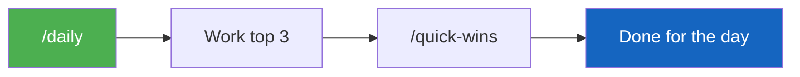

# Slash Commands

Type `/` in the VS Code Copilot chat panel to see available commands. Each one detects your role and tailors the experience.

---

## Available Commands

| Command | When to Use | What It Does |
|---------|-------------|-------------|
| `/getting-started` | First time | Checks your environment, identifies your role, walks you to first success |
| `/my-role` | Anytime | Shows your role, responsibilities, and a menu of actions |
| `/daily` | Every morning | Role-specific hygiene checks + prioritized top-3 action list |
| `/weekly` | Monday / pre-governance | Full pipeline or milestone review with shareable status bullets |
| `/what-next` | Idle moment | Recommends exactly 3 things to do, ranked by impact |
| `/quick-wins` | Anytime (~5 min) | Finds CRM hygiene issues you can fix immediately |

---

## Recommended Daily Flow



```
First time:  /getting-started  →  pick an action from the menu
Daily:       /daily            →  work through top 3  →  /quick-wins if time
Weekly:      /weekly           →  drill into flagged items
Ad hoc:      /what-next        →  follow the suggestions
```

---

## Creating Your Own Slash Commands

Files in `.github/prompts/` automatically appear as slash commands in VS Code. Create one for any workflow you repeat often.

**Example:** `.github/prompts/quarterly-review-prep.prompt.md`

```markdown
---
description: "Prepare a quarterly business review deck."
---

# Quarterly Review Prep

1. Use `list_opportunities` for {customer} — get all active opportunities.
2. Use `get_milestones` for each — summarize status and blockers.
3. Use `ask_work_iq` — find recent executive emails or meeting decisions.
4. Format as a QBR summary: pipeline, delivery, risks, asks.
```

After saving, type `/` in chat to see it in the menu.

!!! info "Copilot CLI note"
    Slash commands are a VS Code feature. In Copilot CLI, open the prompt file and paste the content, or just describe what you need in natural language.
